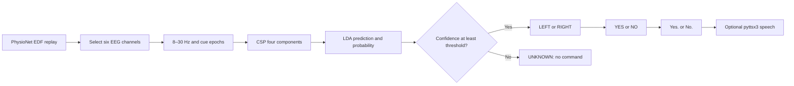

# TWSS technical overview

Verified software state: 2026-10-02. **Completed** means implemented and exercised on local dataset replay or automated tests. **Experimental** means a separate offline research result. **Planned** means no completed implementation/validation. **Not verified** identifies claims that the available evidence cannot support. The original Phase-1 artifacts remain frozen.

## 1. Problem Statement

TWSS explores a small EEG-driven communication interface for selecting YES or NO using left/right hand motor imagery. It translates a classifier decision into a predefined sentence and optional computer speech. It does not recognize arbitrary thoughts, unrestricted imagined language, or intended answers independently of the trained imagery tasks.

## 2. Scope

Completed scope is a reproducible, subject-specific two-class dataset MVP. The stored S001 model supports replay demonstrations. Separate leave-one-run-out evaluation measures generalization to an unseen run from the same subject. Real communication with a new participant, clinical utility and deployment reliability are not verified. No deep learning or REST classifier was added.

## 3. Current MVP



The Streamlit app orchestrates existing `Trial`, inference, mapping, sentence and speech modules through `CommandController`. Acquisition and classification are separate boundaries.

## 4. Dataset

Phase 1 uses PhysioNet EEGMMIDB v1.0.0, S001–S010, R04/R08/R12. T1 denotes left-hand imagery, T2 right-hand imagery; T0 is ignored. These label meanings depend on the chosen runs. There are 45 retained trials/subject, 450 across ten subjects: 230 LEFT and 220 RIGHT. Files are found under the existing `data/` paths by the shared loader.

The original dataset has 109 volunteers, 64 EEG signals sampled at 160 Hz and fourteen runs/subject. Its task descriptions distinguish movement from imagery and hand imagery from bilateral hand/foot imagery. [PhysioNet dataset documentation](https://physionet.org/content/eegmmidb/1.0.0/).

SRM ds003775 is a separate resting-state representation dataset, not a left/right imagery training set. The downloaded README describes eyes-closed, average-referenced raw recordings; our download inventory and current processing details are in `results/phase3/REPRODUCIBILITY_STATUS.md`.

## 5. EEG Channels

Frozen order: FC3, FC4, C3, C4, CP3, CP4. The selector normalizes case and trailing periods, requires one unambiguous match per channel and retains this exact order. New experiments pass explicit six-channel montages through the same selector without changing its default. No experiment changes the saved model's expected order.

## 6. Preprocessing

MNE loads EDF into memory, selects EEG and filters each run independently with the existing 8–30 Hz default FIR filter. Epochs span 0.5–3.5 seconds after T1/T2, `baseline=None`, `proj=False`. MNE includes both endpoints, giving 481 samples at 160 Hz: one subject has `X=(45,6,481)`. Labels and run groups accompany these arrays.

No ICA, ASR, notch filter, amplitude rejection, re-referencing change or new resampling was added to frozen preprocessing. Offline whole-run filtering uses future samples within the same run; it is not a validated causal online filter. Separate frequency experiments reuse the existing FBCSP loader with one explicit band at a time. Tests confirm its 8–30 Hz epochs exactly match the original loader.

## 7. CSP

`build_pipeline()` constructs MNE `CSP(n_components=4)` with the existing defaults. CSP learns supervised spatial projections from training EEG. Its four log mean-square component powers become LDA inputs. A fresh CSP is fit per held-out split. Filters, sensor patterns and transformed classifier features are distinct; their current visualizations are in `results/csp_analysis/`.

Six-sensor interpolated maps are descriptive, not brain-source localization. Representative subjects are S001, high-performing S007 and low-performing S008. For interpretation, fit R08+R12 and visualize R04 features only.

## 8. LDA

The unchanged sklearn `LinearDiscriminantAnalysis()` follows CSP. `predict()` gives a raw LEFT=1/RIGHT=2 class; `predict_proba()` supplies its probability. This is an LDA model probability, not an independently calibrated confidence guarantee. The frozen saved pipeline was trained on all 45 S001 trials, while evaluation pipelines remain in memory and train on thirty trials per fold.

## 9. Evaluation Strategy

Each subject has three folds: train R08+R12/test R04; train R04+R12/test R08; train R04+R08/test R12. Test runs never enter CSP/LDA fitting. Subjects are evaluated independently; this is not leave-one-subject-out testing. Confusion matrices use LEFT/RIGHT row and column order. F1 uses LEFT as the positive class. Accuracy, balanced accuracy, binary F1 and MCC are exported.

Frozen summary mean/SD use thirty fold scores, sample SD with `ddof=1`. Descriptive analysis also reports SD across ten subject means and within-subject three-run SD; these are different quantities, not confidence intervals. No random trial train/test split is used. Candidate selection and threshold inspection on the same held-out data are exploratory, and require independent confirmation before adoption.

## 10. Confidence Rejection

Default threshold stays 0.70. Confidence equal to the threshold is accepted. Below threshold, or without usable probabilities, the gated decision becomes UNKNOWN and yields no word, sentence or audio. UNKNOWN is not a trained REST class. Raw class/probability remain available for debugging; communication follows the gated decision.

The new analysis uses 450 baseline out-of-fold predictions. At 0.70, 319 are accepted and 131 rejected: 227 correct accepted, 92 incorrect accepted, coverage 70.89%, accepted accuracy 71.16%, false-command rate 20.44% of all attempts. At 0.95, coverage is 32.44%, accepted accuracy 86.99%, false-command rate 4.22%. This tradeoff does not establish an optimal threshold or a clinical safety claim.

## 11. TWSS Mapping

| Accepted imagery decision | Word | Sentence |
|---|---|---|
| LEFT | YES | Yes. |
| RIGHT | NO | No. |
| UNKNOWN | None | None |

The mapping is a programmed vocabulary assignment, not evidence that EEG encodes the semantic words YES and NO directly.

## 12. TTS

`src/twss/speech.py` wraps optional pyttsx3. Existing Windows COM initialization/cleanup stays on the speech thread. UI speech is disabled by default and only invoked by Speak. `--no-audio` supports silent CLI testing. Automated tests mock speaking; audible output on this computer and user experience remain not verified by these tests. No speech architecture was replaced.

## 13. UI

Run from the root:

```powershell
.venv/Scripts/python.exe -m streamlit run ui/app.py
```

Navigation: Dashboard, Held-Out Demo, Evaluation, Model Comparison, Research / About. Dashboard displays the exact warning “Demonstration only — replay data may include model training data”. It retains the saved S001 model, waveform, prediction, probability, YES/NO, sentence, Start Command and optional Speak. Actual label is hidden unless Debug Mode is enabled.

Held-Out Demo chooses subject/run, fits the existing pipeline on the other two runs and replays only the selected held-out run. Actual labels are visible for evaluation. Changing mode/subject/run resets replay state and prevents stale outputs. Evaluation and Model Comparison load stored reports; they do not train models or derive accuracy from dashboard interactions. AppTest exercises navigation, gating, reset, failures, held-out sources and mocked speech.

## 14. Acquisition Architecture

Existing `BaseEEGStream` declares start, stop, get_samples, get_window. Dataset simulation and optional LSL Beast acquisition use this interface. Calibration collects balanced randomized LEFT/RIGHT cues, optional REST labels, and saves NPZ plus JSON/CSV provenance. REST collection does not add a REST classifier.

Existing LSL code can discover/filter/connect/pull/buffer with timeout, finite-sample and channel checks; synthetic LSL testing is implemented. Actual Beast USB transport, channel identity, units, montage, timestamp behavior and raw-live-to-model adaptation remain not verified on hardware. This task added no hardware functionality and does not connect raw Beast data directly to the frozen UI. The separate USB kit guide remains an initial setup reference.

## 15. Current Results

Frozen Phase-1 mean fold accuracy is **64.67% ± 18.71 percentage points**; S001 mean is **68.89%**. Mean balanced accuracy 0.649107, F1 0.637880, MCC 0.318166. Best/worst subject means: S007 95.56%, S008 40.00%. See `results/analysis/analysis_summary.md` for stored-score visualizations and variability.

Experimental six-channel leader: CP1, CP2, CP3, CP4, C3, C4, 68.22% mean; experimental band leader with the frozen six channels: 12–30 Hz, 69.33% mean. These are separate comparisons, not a tested combination. They are not changes to Phase 1 and were not selected using S001 alone.

Current Phase-3 reproduction: SRM five subjects/eight recordings, 960 windows, 64 channels, 1024 Hz, 3168 features; PhysioNet S001 45 trials, six channels, 160 Hz, 123 features. All 153 SRM EDF headers were inspected: 152 readable across 110 subjects; one sub-041 date field errors with `second must be in 0..59, not 60`. Historical Phase-3 outputs are archived. Representation figures do not establish classification performance.

## 16. Model Comparison

| Model | Reproduced mean accuracy | Fold sample SD |
|---|---:|---:|
| CSP+LDA | 64.67% | 18.71 pp |
| FBCSP+LDA | 68.00% | 13.94 pp |
| Riemannian MDM | 66.22% | 16.23 pp |
| Tangent-space LDA | 59.11% | 16.40 pp |

All sixteen accuracy/balanced-accuracy/F1/MCC aggregate means match historical Phase-2 values within 1e-12. Seed zero controls FBCSP mutual-information estimation and plotting jitter. Outputs are in `results/phase2_reproduction/`; `results/phase2/` was not overwritten. These implementations are experimental comparators, not exact replications of each literature paper.

## 17. Limitations

Only ten subjects enter these evaluations, with fifteen trials/test run. No independent montage/band/threshold confirmation set, statistical superiority claim, causal online validation, speech decoding, cross-subject deployment validation or patient testing is established. Offline probabilities may be overconfident. Dataset annotations provide intended tasks, not verification of successful imagery. Residual eye/muscle/movement artifacts may affect CSP. A six-channel cap and different hardware reference/rate can create distribution shifts. One SRM source header is unreadable with the current MNE parser.

## 18. Remaining Work

Planned software step: define an independent confirmation protocol before adopting exploratory leaders, with held-out subjects or later sessions and a declared command-error/rejection cost. Add probability calibration fitted only inside training data, then evaluate coverage and false commands on untouched data. Preserve Phase 1 throughout. Actual kit setup, signal-quality inspection, own-subject collection and later live adapter validation are separate work; none is claimed completed here.

## 19. Future Research

Possible work includes robust artifact assessment, session transfer, carefully validated sensor reduction, probability calibration, explicit idle-state experiments, and synchronized EEG/EMG decision fusion where residual muscle control exists. Imagined speech/KARA ONE is a different task with different labels and signal requirements, not an extension validated by the current YES/NO mapping. The sourced literature review separates implemented methods from such possibilities. No CNN/LSTM/deep model was implemented in this task.
