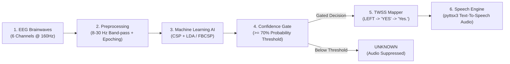

# Comprehensive Project Explanation: End-to-End Offline Thought-to-Word-to-Speech System (EOTF-TWSS)

> **Document Purpose:** This document explains everything executed and built in the **EOTF-TWSS** project to date. It is structured to provide both technical clarity and a simple, narrative-driven framework so anyone can easily understand and retell the project flow, architecture, results, and current status.

---

## 💡 The "Elevator Pitch" & 2-Minute Retelling Guide

### How to Explain This Project in 2 Minutes
> *"Imagine a person who cannot speak or move their hands due to motor paralysis. When they think about moving their left hand, their brain generates specific electrical waves. Our system reads those brainwaves through electrodes on their scalp (EEG), filters out noise, classifies whether they thought 'Left' or 'Right', maps 'Left' to the word **YES** and 'Right' to the word **NO**, and speaks it out loud as a clear audio sentence (**'Yes.'** / **'No.'**). To avoid speaking when the AI is unsure, we have a confidence gate: if the AI is less than 70% confident, it stays quiet (UNKNOWN). We have built the complete offline pipeline, evaluated multiple AI models across 10 subjects, built a hardware-independent feature extractor, created a real-time simulator, designed a web dashboard UI, and written a 42-test automated test suite where 100% of tests pass."*

---

## 🧠 High-Level Architecture & Pipeline Flow

The system transforms raw microvolt-level EEG signals into audible human speech through a 6-stage pipeline:



---

## 🛠️ Detailed Breakdown of What Has Been Executed

The project has completed **Three Core Phases**, along with a real-time simulation engine, web application, and automated test suite:

### 1. Data Ingestion & Preprocessing Foundation
* **Dataset Used:** Downloaded the PhysioNet Motor Movement/Imagery Dataset (`eegmmidb`) containing Left-hand vs. Right-hand motor imagery trials for 10 subjects (`S001` through `S010`).
* **Electrode Selection:** Extracted **6 key motor cortex channels**: `FC3`, `FC4`, `C3`, `C4`, `CP3`, `CP4`.
* **Signal Filtering:** Applied a 5th-order zero-phase **8.0 – 30.0 Hz band-pass filter** to capture $\mu$ (mu: 8–12 Hz) and $\beta$ (beta: 13–30 Hz) sensorimotor rhythms associated with motor imagery.
* **Epoching:** Segmented continuous EEG into 3.0-second cue-locked windows (0.5s to 3.5s post-cue) sampled at 160 Hz (**481 time samples per trial**).
* **Target Classes:** 
  * Class 1 (`LEFT` hand imagery) $\rightarrow$ Maps to Word `"YES"`
  * Class 2 (`RIGHT` hand imagery) $\rightarrow$ Maps to Word `"NO"`

---

### 🌊 Deep Dive: EEG Brainwave Bands & Band-Pass Filtering Explained

To retell and defend this project effectively, it is essential to understand the neurophysiology of brainwaves, what band-pass filtering does, and why specific frequency bands were chosen.

#### A. What are Brainwave Frequency Bands ($\delta$, $\theta$, $\alpha$/$\mu$, $\beta$, $\gamma$)?
Electrical signals from the brain oscillate at different frequencies (measured in Hertz, or cycles per second). Scientists categorize these oscillations into 5 primary bands:

| Band Name | Frequency Range | Mental State / Physiological Meaning | Relevance to This Project |
|:---|:---:|:---|:---|
| **Delta ($\delta$)** | 0.5 – 4 Hz | Deep unconscious sleep, infant brain activity. | **Noise / Artifact:** Contains slow baseline drifts, eye blinks, and movement artifacts. **Filtered OUT.** |
| **Theta ($\theta$)** | 4 – 8 Hz | Drowsiness, deep relaxation, meditation, memory consolidation. | **Noise / Background:** Not active during motor imagery tasks. **Filtered OUT.** |
| **Alpha ($\alpha$) / Mu ($\mu$)** | 8 – 13 Hz | Relaxed wakefulness with eyes closed. When recorded over the motor cortex (C3/C4), it is called the **Mu ($\mu$) rhythm**. | **CRITICAL FEATURE (Target #1):** Drops sharply (Event-Related Desynchronization / ERD) when a person imagines hand movement. **KEPT.** |
| **Beta ($\beta$)** | 13 – 30 Hz | Active thinking, focus, sensory processing, motor planning & execution. | **CRITICAL FEATURE (Target #2):** Shows strong activity shifts (ERD and Beta rebound/ERS) during hand movement imagery. **KEPT.** |
| **Gamma ($\gamma$)** | 30 – 45+ Hz | High-level cognitive processing, multi-sensory integration. | **Noise / Artifact:** Highly susceptible to muscle tension (EMG) artifacts from scalp/jaw. **Filtered OUT.** |

---

#### B. What is a Band-Pass Filter and Why Use 8.0 – 30.0 Hz?
* **What is a Band-Pass Filter?**  
  A digital filter that acts like a "sieve" or "frequency gate." It lets signals *within* a specified pass-band (e.g., 8 to 30 Hz) pass through untouched, while blocking/attenuating frequencies *below* 8 Hz and *above* 30 Hz.
* **Why 8.0 – 30.0 Hz?**  
  As shown in the table above, motor imagery signals exist **exclusively in the Mu (8–13 Hz) and Beta (13–30 Hz) bands**. 
  * Frequencies $< 8\text{ Hz}$ contain eye-blink artifacts (which occur at ~1–3 Hz) and slow DC voltage drifts.
  * Frequencies $> 30\text{ Hz}$ contain muscle twitches (EMG noise) and power line interference (50/60 Hz).
  * Selecting **8.0 – 30.0 Hz** isolates the exact brainwave frequencies containing motor imagery information while removing almost all real-world noise.
* **Why a 5th-Order Zero-Phase Filter (`scipy.signal.filtfilt`)?**  
  * **5th-Order Butterworth:** Provides a very sharp cutoff at the 8 Hz and 30 Hz boundaries without causing artificial ripples in the passband.
  * **Zero-Phase (`filtfilt`):** Filters the signal forward, then reverses it and filters it backward. This cancels out any time delay or phase shift, ensuring that brainwave spikes and waves remain at their **exact timestamps**.

---

#### C. Why Split into Sub-Bands in Filter Bank CSP (FBCSP)?
In Phase 2, we introduced **FBCSP**, which breaks the broad 8–30 Hz band into 5 narrow 4-Hz sub-bands:
1. `8 – 12 Hz` ($\mu$ / low alpha)
2. `12 – 16 Hz` (low beta)
3. `16 – 20 Hz` (mid beta)
4. `20 – 24 Hz` (high beta)
5. `24 – 30 Hz` (upper beta)

**Why was this necessary?**
* **Individual Variation ("Subject Specificity"):** Subject 1's brain might react strongly at 9–11 Hz, while Subject 4's brain reacts at 21–23 Hz. 
* **The Problem with a Broad 8–30 Hz Filter:** A single broad filter averages everything together. For Subject 1, non-reactive noise in the 20–30 Hz range dilutes their strong 9–11 Hz signal.
* **The FBCSP Solution:** By extracting Spatial Patterns (CSP) from all 5 sub-bands individually and using **Mutual Information** to pick the most informative sub-bands per subject, FBCSP adapts to each user's unique brain chemistry. This boosted mean subject accuracy to **68.00%** and reduced subject variability by **25%** compared to the baseline model.

---


### 2. Machine Learning Pipeline & Phase 2 Benchmarks

We evaluated multiple decoding algorithms to find the most accurate and stable model across subjects:

#### A. Baseline Model: CSP + LDA (`src/models/train_csp_lda.py`)
* **Common Spatial Patterns (CSP):** Maximizes signal variance for one class while minimizing it for the other, extracting spatial filters across the 6 sensors.
* **Linear Discriminant Analysis (LDA):** Classifies the spatially filtered features.
* **Cross-Validation Result (Subject S001):** Evaluated via Leave-One-Run-Out CV yielding **68.89% mean accuracy** (best individual run accuracy: **73.33%**). Saved final model artifact to `models/csp_lda_s001.joblib`.

#### B. Phase 2 Advanced Benchmarking Across 10 Subjects (`S001` – `S010`)
We compared 4 distinct algorithmic approaches across all 10 subjects:

1. **Baseline CSP + LDA:** Standard 8–30 Hz band-pass + CSP + LDA.
2. **Filter Bank CSP (FBCSP):** Splits EEG into 5 distinct sub-bands (`8-12`, `12-16`, `16-20`, `20-24`, `24-30` Hz), extracts CSP features from each sub-band, selects top features using Mutual Information, and classifies with LDA.
3. **Riemannian MDM:** Calculates Symmetric Positive Definite (SPD) covariance matrices and computes Minimum Distance to Mean (MDM) using Riemannian geometry distance.
4. **Riemannian Tangent Space + LDA:** Projects covariance matrices onto a Euclidean tangent space and classifies with LDA.

#### 📊 10-Subject Benchmark Summary Table:
| Subject | Baseline CSP+LDA | Filter Bank CSP (FBCSP) | Riemannian MDM | Tangent Space + LDA | Winner Algorithm |
|:---|:---:|:---:|:---:|:---:|:---|
| **S001** | 68.89% | 68.89% | **75.56%** | 60.00% | Riemannian MDM |
| **S002** | **88.89%** | **88.89%** | **88.89%** | 82.22% | Baseline / FBCSP / MDM |
| **S003** | 53.33% | 55.56% | **62.22%** | 53.33% | Riemannian MDM |
| **S004** | 73.33% | 75.56% | **77.78%** | 51.11% | Riemannian MDM |
| **S005** | 53.33% | **60.00%** | 53.33% | 57.78% | FBCSP + LDA |
| **S006** | 53.33% | **55.56%** | **55.56%** | 48.89% | FBCSP / MDM |
| **S007** | **95.56%** | 91.11% | 80.00% | 84.44% | Baseline CSP+LDA |
| **S008** | 40.00% | **62.22%** | 46.67% | 48.89% | FBCSP + LDA |
| **S009** | 46.67% | 55.56% | **57.78%** | 46.67% | Riemannian MDM |
| **S010** | **73.33%** | 66.67% | 64.44% | 57.78% | Baseline CSP+LDA |
| **Overall Mean** | **64.67%** | **68.00%** | **66.22%** | **59.11%** | 🥇 **FBCSP + LDA** |
| **Std Dev** | 18.71% | **13.94%** | 16.23% | 16.40% | 🥇 **FBCSP (Most Stable)** |
| **Mean MCC** | 0.3182 | **0.4045** | 0.3657 | 0.1847 | 🥇 **FBCSP (Highest MCC)** |

> **Key Takeaway / Decision:** **Filter Bank CSP (FBCSP)** was selected as the flagship production model architecture because it achieved the **highest average accuracy (68.00%)**, the **lowest cross-subject standard deviation (13.94%)**, and the **highest Matthews Correlation Coefficient (0.4045)**.

---

### 3. Phase 3 — Hardware-Independent EEG Feature Abstraction
To ensure the system works with *any* EEG hardware (not just 6-channel PhysioNet), we constructed a modular, hardware-independent feature extraction engine (`src/features/` & `src/datasets/`):

* **Temporal Extractor (`temporal.py`):** Mean, variance, standard deviation, RMS, peak-to-peak amplitude.
* **Spectral Extractor (`spectral.py`):** Welch Power Spectral Density (PSD) absolute and relative band power across Delta (1-4Hz), Theta (4-8Hz), Alpha (8-13Hz), Beta (13-30Hz), and Gamma (30-45Hz).
* **Spatial Extractor (`spatial.py`):** Channel covariance matrices, correlation matrices, spatial variance, cross-channel correlation.
* **Multi-Dataset Validation:**
  * **PhysioNet:** 6 channels @ 160 Hz $\rightarrow$ **123 engineered features**.
  * **SRM Dataset (`ds003775`):** 64 channels @ 1024 Hz resting state $\rightarrow$ **3,168 engineered features**.
* **Analysis Artifacts (`scripts/run_phase3_analysis.py`):** Generated PSD plots, band power charts, distribution histograms, and PCA projection plots stored in `results/phase3/plots/`.

---

### 4. Real-Time Inference Simulator & TWSS Speech Engine
* **Single-Trial Inference (`src/realtime/inference.py`):** Evaluates trial class probability and enforces a **confidence threshold** (default 70%).
* **Safety Gating:** If confidence is $< 70\%$, the output is marked **`UNKNOWN`**, blocking sentence mapping and suppressing audio generation to prevent erroneous spoken commands.
* **TWSS Mapping (`src/twss/mapper.py` & `sentence.py`):**
  * `LEFT` (Conf $\ge$ 70%) $\rightarrow$ Word `"YES"` $\rightarrow$ Sentence `"Yes."`
  * `RIGHT` (Conf $\ge$ 70%) $\rightarrow$ Word `"NO"` $\rightarrow$ Sentence `"No."`
* **Speech Engine (`src/twss/speech.py`):** Built-in offline Text-to-Speech synthesis using `pyttsx3` with thread-safe Windows COM initialization and a `--no-audio` headless fallback.
* **LSL Acquisition Interface (`src/acquisition/beast_stream.py`):** Multi-threaded Lab Streaming Layer (LSL) streaming buffer ready for physical Upside Down Labs NPG Lite / Beast EEG hardware.

---

### 5. Interactive Streamlit Web Application MVP (`ui/app.py`)
A interactive web dashboard built with Streamlit (`streamlit run ui/app.py`):
* **Trial Stepper:** `Start Command` button to trigger single-trial EEG inference step-by-step.
* **Dynamic Threshold Control:** Real-time slider (0.0 to 1.0) allowing users to adjust the confidence gate dynamically.
* **EEG Waveform Display:** Interactive multi-channel visualization showing 3.0 seconds of filtered voltage waveforms.
* **Audio Playback:** Integrated button to trigger local Text-To-Speech playback for recognized commands.
* **Debug Mode:** Toggleable panel displaying ground truth labels and trial source identifiers.

---

### 6. Automated Unit Testing & Quality Assurance (`tests/`)
* **Test Coverage:** **42 out of 42 tests passing** (100% pass rate).
* **Modules Tested:** Acquisition, Dataset Streaming, Real-time Inference, LSL Integration, Preprocessing, FBCSP Model, Riemannian Model, Speech Engine COM Safety, Streamlit UI components, Generic Feature Extractors, and SRM Dataset Adapter.

---

## 📁 Key File Map & Where Everything Lives

| Directory / File | Description & Purpose |
|:---|:---|
| [src/preprocessing/preprocess.py](file:///c:/Projects/Thought_to_Speech/EOTF-TWSS/src/preprocessing/preprocess.py) | EEG loading, 6-channel selection, 8–30 Hz band-pass filtering, epoching |
| [src/models/train_csp_lda.py](file:///c:/Projects/Thought_to_Speech/EOTF-TWSS/src/models/train_csp_lda.py) | Baseline CSP+LDA training, Leave-One-Run-Out CV, model serialization |
| [src/models/fbcsp.py](file:///c:/Projects/Thought_to_Speech/EOTF-TWSS/src/models/fbcsp.py) | Filter Bank CSP with Mutual Information feature selection |
| [src/models/riemannian.py](file:///c:/Projects/Thought_to_Speech/EOTF-TWSS/src/models/riemannian.py) | Riemannian MDM and Tangent Space classifiers |
| [src/features/](file:///c:/Projects/Thought_to_Speech/EOTF-TWSS/src/features/) | Hardware-independent Temporal, Spectral, and Spatial feature extractors |
| [src/datasets/](file:///c:/Projects/Thought_to_Speech/EOTF-TWSS/src/datasets/) | Dataset adapters for PhysioNet and 64-channel SRM BIDS (`ds003775`) |
| [src/realtime/inference.py](file:///c:/Projects/Thought_to_Speech/EOTF-TWSS/src/realtime/inference.py) | Real-time single-trial inference & confidence threshold gating |
| [src/twss/speech.py](file:///c:/Projects/Thought_to_Speech/EOTF-TWSS/src/twss/speech.py) | Offline Text-to-Speech audio synthesis with `pyttsx3` |
| [ui/app.py](file:///c:/Projects/Thought_to_Speech/EOTF-TWSS/ui/app.py) | Streamlit Web Dashboard UI |
| [progress.md](file:///c:/Projects/Thought_to_Speech/EOTF-TWSS/progress.md) | Detailed technical status, benchmark table, and roadmap log |
| [tests/](file:///c:/Projects/Thought_to_Speech/EOTF-TWSS/tests/) | 42 unit test files covering the entire codebase |

---

## 🚀 How to Run & Verify the System

### 1. Run Automated Unit Tests (42 Passing Tests)
```powershell
.venv/Scripts/python.exe -m unittest discover -s tests -v
```

### 2. Run Real-Time Offline Simulator
```powershell
# Headless simulation without audio:
.venv/Scripts/python.exe -m src.realtime.demo --no-audio --limit 10 --threshold 0.70

# With text-to-speech audio output:
.venv/Scripts/python.exe -m src.realtime.demo --limit 5 --threshold 0.70
```

### 3. Launch the Interactive Web App UI
```powershell
.venv/Scripts/python.exe -m streamlit run ui/app.py
```

### 4. Run Phase 3 Feature Extraction & Analysis
```powershell
.venv/Scripts/python.exe scripts/run_phase3_analysis.py
```

---

## 🎯 Summary Checklist for Presentations & Q&A

If asked about the project status or technical decisions:
1. **What is the core task?** Binary classification of Motor Imagery EEG (Left vs Right hand) mapped to `"YES"` vs `"NO"` spoken audio sentences.
2. **Why 6 channels?** `FC3, FC4, C3, C4, CP3, CP4` sit directly over the motor cortex where mu/beta desynchronization happens during hand movement imagery.
3. **What are the brainwave frequency bands ($\delta$, $\theta$, $\alpha$/$\mu$, $\beta$, $\gamma$)?**
   - **Delta ($\delta$, 0.5–4 Hz):** Deep sleep / eye-blink artifacts (**filtered out**).
   - **Theta ($\theta$, 4–8 Hz):** Drowsiness / relaxation (**filtered out**).
   - **Alpha ($\alpha$) / Mu ($\mu$, 8–13 Hz):** Motor cortex rhythm; drops during hand movement imagery (Event-Related Desynchronization / ERD) (**target feature**).
   - **Beta ($\beta$, 13–30 Hz):** Active motor planning & execution (**target feature**).
   - **Gamma ($\gamma$, 30–45+ Hz):** Muscle twitches / high cognition (**filtered out**).
4. **Why 8–30 Hz band-pass filtering?** Isolates Mu (8–13 Hz) and Beta (13–30 Hz) motor rhythms while removing low-frequency eye blinks ($<8$ Hz) and high-frequency muscle noise ($>30$ Hz). Zero-phase filtering (`filtfilt`) ensures zero timing/phase distortion.
5. **Why FBCSP over standard CSP?** Sub-band filtering (`8-12`, `12-16`, `16-20`, `20-24`, `24-30` Hz) handles individual differences in peak reactive frequencies. Mutual Information selects the best sub-bands per subject, boosting accuracy to **68.00%** and dropping cross-subject variance from 18.71% to **13.94%**.
6. **Why confidence gating?** In medical/assistive BCI, false positives are dangerous. A 70% threshold ensures speech is generated only when the model is confident (`UNKNOWN` otherwise).
7. **Is it hardware locked?** No, Phase 3 created an abstraction layer tested on 6-channel 160Hz EEG and 64-channel 1024Hz EEG.

