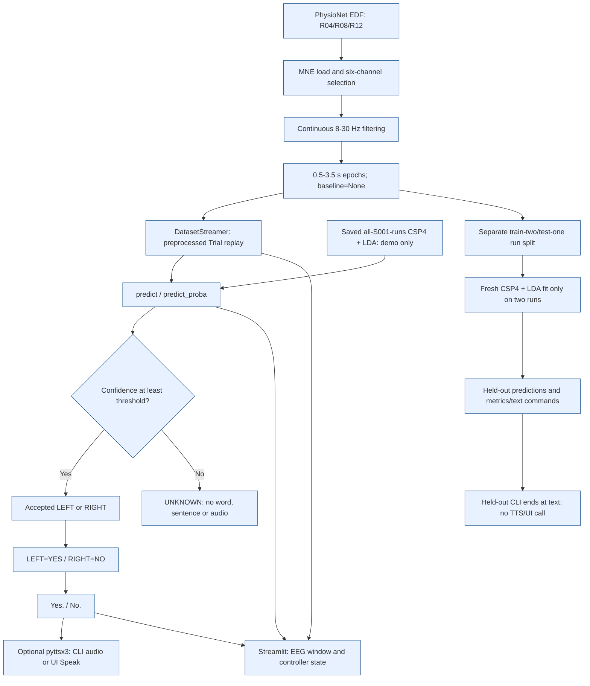
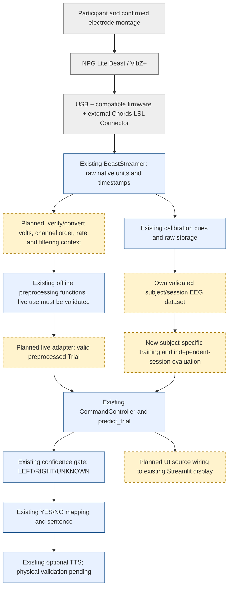

# A. PROJECT OVERVIEW

**Inspection date:** 2026-10-02, Asia/Calcutta. **Project root:** `D:\EOTF-TWSS`. **Repository:** `https://github.com/AnjanThakur/EOTF-TWSS.git`. **Current HEAD:** `145519d`; the report includes the existing modified/untracked working tree, not just committed HEAD. The only deliverable added during this status inspection is this report. No production code, config, model or result was changed; the current test suite was run, including its temporary in-memory estimator fits.

Status terms throughout: **Completed** means the stated software/artifact is implemented, with its verification limits specified; **Partially completed** means implementation exists but integration, reproducibility or physical validation is incomplete; **Planned/not implemented** means no corresponding working implementation was found. **Not verified** means evidence is insufficient; it does not assert that the work never happened.

| Item | Current factual description | Evidence |
|---|---|---|
| Project title/purpose | TWSS BCI / EEG-to-speech command prototype in repository EOTF-TWSS. README title is “TWSS BCI: first-stage EEG preprocessing”; UI title is “TWSS · EEG to speech”. A single formal academic project title is **Not verified**. | `README.md`; `ui/app.py`; `explanation.md` |
| Current MVP | Offline PhysioNet EEG trial replay, six-channel preprocessing, CSP+LDA, confidence-gated LEFT/RIGHT commands, YES/NO sentences, optional pyttsx3 speech and Streamlit display. | `src/realtime/`; `src/preprocessing/preprocess.py`; `src/twss/`; `ui/app.py` |
| BCI paradigm | Cued, two-class left/right hand motor imagery; run-level offline evaluation. No arbitrary thought, imagined-speech or continuous REST classifier. | `src/preprocessing/preprocess.py`; `configs/phase1_config.yaml` |
| Input | Recorded EDF EEG, then preprocessed volts shaped `(6, 481)` per inference trial. LSL separately acquires native-unit samples, not inference-ready trials. | `src/models/train_csp_lda.py`; `src/realtime/trial.py`; `src/acquisition/beast_stream.py` |
| Output | Raw class 1/2 and LEFT/RIGHT name, predicted-class probability, gated LEFT/RIGHT/UNKNOWN, optional word/sentence/speech, EEG/UI display. | `src/realtime/inference.py`; `src/realtime/controller.py`; `ui/app.py` |
| Vocabulary | LEFT → YES → `Yes.`; RIGHT → NO → `No.`; UNKNOWN → no word/sentence/audio. These words are assigned commands, not directly decoded semantic answers. | `src/twss/mapper.py`; `src/twss/sentence.py` |
| Planned hardware | Six-channel NPG Lite Beast with VibZ+, USB first, via a compatible external Chords LSL Connector. Receipt is user-reported; serial number, firmware, connected hardware and participant EEG are **Not verified** from repository evidence. | `docs/USB_KIT_GUIDE.md`; `src/acquisition/beast_stream.py` |
| Current phase | Frozen Phase 1 experiment plus implemented Phase 2 comparison research, partially reproducible Phase 3 feature research, and software preparation for live hardware acquisition. | `configs/phase1_config.yaml`; `results/phase1/`; `results/phase2/`; `results/phase3/REPRODUCIBILITY_STATUS.md` |

**Concise implemented flow:** PhysioNet EDF → six-channel selection → 8–30 Hz filtering → 0.5–3.5 s epochs → CSP features → LDA → confidence gate → LEFT/RIGHT/UNKNOWN → YES/NO → sentence → optional TTS + Streamlit UI. The UI controls processing and displays EEG/results; it is not a transformation of audio.

**Installed software stack, checked against `requirements.txt`:** Python 3.14.7; mne 1.13.2; numpy 2.5.3; scipy 1.18.1; matplotlib 3.11.2; scikit-learn 1.9.1; pandas 3.0.6; joblib 1.6.0; pyttsx3 2.99; streamlit 1.64.0; pylsl 1.18.2; PyYAML 6.0.3; pyriemann 0.12. Every direct pinned version matched the installed distribution. Current `pip check` returned `No broken requirements found.` Windows speech additionally imports `pythoncom`; the full previous environment snapshot is `results/review_2026-10-02/environment.txt`.

# B. FULL IMPLEMENTATION INVENTORY

“Tested” below distinguishes current automated tests, stored execution evidence, and physical validation. Current test details are in section I; a passing test does not validate every property of a module.

| Component | Status | What it does | Exact file(s) | Tested? | Result |
|---|---|---|---|---|---|
| Dataset loading | Completed for chosen public data | Loads valid imagery EDFs, checks path/name/EEG channels. | `src/preprocessing/preprocess.py` | Current integration tests; 30 current EDF headers inspected | Chosen files exist; 64 EEG channels, 160 Hz |
| Six-channel selection | Completed | Normalizes case/trailing periods, preserves order, rejects missing/ambiguous matches. | `src/models/train_csp_lda.py` | Integrated; earlier explicit validation report | FC3, FC4, C3, C4, CP3, CP4 |
| Continuous preprocessing | Completed offline | Filters a copy of each continuous EEG run to 8–30 Hz with existing MNE defaults. | `src/preprocessing/preprocess.py` | Indirect real-data tests | No source mutation, artifact-removal or causal adapter claimed |
| Annotation events | Completed | Explicit T0=0, T1=1, T2=2; requires both imagery classes. | `src/preprocessing/preprocess.py` | Indirect; `notebooks/outputs/run_report.txt` | T0 excluded from classifier epochs |
| Epoching/X/y | Completed | 0.5–3.5 s, baseline=None, preload, proj=False; labels follow retained events. | `src/preprocessing/preprocess.py` | Indirect current tests and stored output | 481 samples at 160 Hz; S001 45 epochs |
| Raw EEG plotting runner | Completed | Prints metadata/events/shapes and plots raw EEG. | `notebooks/test_load.py`; `notebooks/outputs/run_report.txt` | Stored run evidence; not rerun to avoid output writes | S001R04 `(15,64,481)` before selection |
| CSP | Completed | MNE CSP with four components, inside fresh per-fold pipelines. | `src/models/train_csp_lda.py` | Current S001 evaluation and model loading | Saved CSP filters `(6,6)`; four LDA inputs |
| LDA | Completed | Classifies CSP features and supplies probabilities. | `src/models/train_csp_lda.py` | Current evaluation/inference/UI | Classes `[1,2]` |
| Training/save/reload | Completed for S001 | Evaluates runs then separately fits all 45 trials and saves a pipeline. | `src/models/train_csp_lda.py`; `models/training_report.txt` | Stored training/reload evidence | Training command was not run during this audit |
| Saved deployment model | Completed | Stores fitted CSP+LDA only, without preprocessing/acquisition. | `models/csp_lda_s001.joblib` | Loaded read-only; freeze byte comparison | Exact frozen model; no other deployment joblib model found |
| Multi-subject evaluation | Completed public-data experiment | Ten subjects, three held-out-run folds per subject. | `src/models/phase1_evaluation.py`; `results/phase1/results.json` | Full stored 30-fold results; current suite tests S001 | No skipped subjects; 64.6667% mean accuracy |
| Metrics/confusion matrices | Completed exports | Accuracy, balanced accuracy, binary LEFT-positive F1, MCC and 2×2 fold matrices. | `src/models/phase1_evaluation.py`; `results/phase1/fold_metrics.csv` | Range/count checks; sklearn calculations | Per-subject means in summary; matrices stored per fold |
| Confidence gating | Completed | Uses probability for predicted class with class-order validation. | `src/realtime/inference.py` | `tests/test_inference.py`; UI tests | Default 0.70; equality accepted |
| UNKNOWN state | Completed as rejection | Low/unavailable confidence produces no recognized command. | `src/realtime/inference.py`; `src/realtime/controller.py` | Current inference/UI tests | UNKNOWN is not a learned REST class |
| LEFT/RIGHT integer mapping | Completed | 1=LEFT, 2=RIGHT; actual label optional on Trial. | `src/realtime/inference.py`; `src/realtime/trial.py` | Current inference tests | Raw predicted label separate from gated decision |
| YES/NO mapping | Completed | Converts accepted imagery decisions to words. | `src/twss/mapper.py` | Current inference/UI tests | UNKNOWN returns None |
| Sentence generation | Completed | Converts YES/NO to fixed punctuation/case sentences. | `src/twss/sentence.py` | Current inference tests | Only `Yes.` and `No.` |
| TTS software | Completed software; physical validation partial | Lazy pyttsx3, silent option, per-thread Windows COM initialization and cleanup. | `src/twss/speech.py` | Mocked engine/COM tests pass | Audible output **Not verified** |
| DatasetStreamer | Completed offline source | Replays S001 preprocessed trials in event/run order with optional pacing. | `src/realtime/dataset_stream.py` | Current acquisition/UI tests | Entire epoch replay, not continuous EEG transport |
| RawDatasetStreamer | Completed storage simulation | Replays raw cue-matched LEFT/RIGHT/REST EDF windows without filtering. | `src/realtime/dataset_stream.py` | `tests/test_review_regressions.py` | Four-second imagery `(6,640)`; provenance retained |
| Trial/Prediction contracts | Completed | Define preprocessed epoch and raw/gated prediction records. | `src/realtime/trial.py` | Current inference tests | Inference enforces finite `(6,481)` |
| BaseEEGStream | Completed interface | start/stop/get_samples/get_window; alias of EEGSource; channel-first arrays. | `src/acquisition/base_stream.py` | Fake/dataset/LSL source tests | Source-specific units, not universal volts |
| BeastStream/LSL reader | Completed generic acquisition software; physical integration partial | BeastStream aliases BeastStreamer; discovers/selects streams, pulls chunks into bounded FIFO, reads metadata, rejects bad/stale/gapped input. | `src/acquisition/beast_stream.py` | Local synthetic outlet/inlet plus mocks | No physical Beast validation or volts conversion |
| LSL stream listing | Completed | Prints name/type/channel count/rate/source ID. | `src/acquisition/list_lsl.py` | Run now, exit 0 | `No LSL streams detected.` |
| LSL connection check | Completed | Reads finite window/metadata without classification. | `src/acquisition/check_lsl.py` | Stored synthetic execution log | `(6,300)` at nominal 100 Hz; native units unknown |
| Mock LSL publisher | Completed test utility | Publishes synthetic six-channel sine signals. | `tests/mock_lsl_stream.py` | Used by current LSL tests | Class utility; no standalone main/CLI publishing loop |
| Calibration experiment | Completed framework; own-subject validation partial | Balanced shuffled cues, REST 2 s → imagery 4 s → REST 2 s; source flush, validation and save. | `src/acquisition/calibration.py` | Current fake/raw-simulation tests | Defaults configurable; live human session **Not verified** |
| Raw storage/session protection | Completed software | NPZ samples/metadata/timestamps, JSON, CSV manifest, session complete/failed status; refuses existing session folder. | `src/acquisition/calibration.py` | Current round-trip/failure tests | Saves imagery window; REST periods are cues/waits, not full continuous recordings |
| REST label support | Partially completed extension | Calibration Python API can include REST labels; raw replay supports T0. | `src/acquisition/calibration.py`; `src/realtime/dataset_stream.py` | Limited indirect coverage | No CLI label selector or REST classifier |
| Common orchestration | Completed for preprocessed sources | Clears stale command before acquisition, processes one Trial, refreshes threshold, guards Speak. | `src/realtime/controller.py` | Current UI tests | Requires iterable of Trial objects, not raw BeastStream directly |
| Streamlit UI | Completed dataset MVP | Status, six-channel plot, decision/confidence/word/sentence, Start, Reset, debug and optional Speak. | `ui/app.py` | Two current AppTest tests | Dataset model/source only; physical speech mocked |
| Saved-model demo | Completed | Prints prediction/decision/word/sentence, optional speech, explicit training-data disclaimer. | `src/realtime/demo.py`; `notebooks/outputs/inference_report.txt` | Current inference tests and stored demo output | Not accuracy evidence |
| Held-out demo | Completed text-only leakage-free mode | Fits two runs in memory, predicts only held-out third run. | `src/realtime/heldout_demo.py` | Current S001 test and stored 15-row output | CLI stops at text; it does not call TTS/UI |
| Frozen config/validation | Completed | Freezes settings and rejects mismatched fixed parameters/distinct-run lists. | `configs/phase1_config.yaml`; `src/models/phase1_config.py` | Current config/split regressions | Some scripts still use matching hardcoded defaults, not central YAML loading |
| Phase 2 config | Completed research config | Subjects/runs, five bands, CSP2/band, six features, seed, four comparisons. | `configs/phase2_config.yaml` | Current config tests | Separate from deployment config |
| FBCSP comparison | Completed research implementation | CSP per band, mutual-information selection with seed, then LDA. | `src/models/fbcsp.py`; `src/models/phase2_evaluation.py` | Current synthetic/seed tests; stored benchmark | 68.00% mean; not saved/deployed |
| Riemannian comparisons | Completed research implementation | Ledoit-Wolf covariance → MDM or tangent space → LDA. | `src/models/riemannian.py`; `src/models/phase2_evaluation.py` | Current synthetic tests; stored benchmark | MDM 66.2222%, tangent LDA 59.1111% |
| Phase 2 exports/plots | Completed artifacts | 120 fold rows, summaries and four comparison PNGs. | `results/phase2/`; `scripts/generate_phase2_plots.py` | Prior captured evaluation; scripts inspected | Plot scatter jitter unseeded; plots not regenerated here |
| PhysioNet research adapter | Completed | Reuses existing loading/selection/preprocessing and actual channel/rate metadata. | `src/datasets/physionet.py` | Current real S001 adapter test | Requested runs required; no silent missing-run skip |
| SRM research adapter | Partially completed verification | Validates and windows resting-state EDFs with metadata consistency checks. | `src/datasets/srm.py` | Mock/invalid-path tests; real test skipped | `data/srm/ds003775` absent |
| Temporal/spectral/spatial features | Completed reusable code | 5 temporal, 10 band-power, 2 spatial features/channel plus covariance upper triangle. | `src/features/temporal.py`; `src/features/spectral.py`; `src/features/spatial.py`; `src/features/extractor.py` | 15 feature tests plus regressions | Six-channel representation has 123 features; not CSP inputs in MVP |
| Phase 3 analysis/exports | Partially completed | Generates features, metadata, PSD/band/distribution/PCA plots; standardized PCA now in code. | `scripts/run_phase3_analysis.py`; `results/phase3/` | Stored attempt fails for missing SRM | Historical outputs not reproduced; per-dataset metadata files not yet generated |
| Test suite | Completed current automated check | unittest plus Streamlit AppTest, synthetic LSL and mocks. | `tests/test_*.py` | Run now | 60 discovered, 59 passed, 1 skipped, 0 failures/errors |
| Review validation runner | Completed utility | Captures checks/logs and both public-data evaluations. | `scripts/validate_review.py`; `results/review_2026-10-02/` | Existing captured outputs inspected | Not rerun: it would overwrite research outputs/logs |
| Documentation/environment artifacts | Completed files | README, project explanation/status, detailed review, USB guide and version snapshot. | `README.md`; `explanation.md`; `progress.md`; `docs/`; `requirements.txt`; `results/review_2026-10-02/environment.txt` | Inspected | Historical prose does not supersede source/test evidence |
| Hardware-to-model trial adapter | Planned/not implemented | Would convert/scalefilter/cue-align raw LSL data into valid Trial objects. | No implementation found; plan in `docs/USB_KIT_GUIDE.md` | No | Critical missing integration boundary |

# C. IMPLEMENTATION PERCENTAGE

“Implementation – 25%” is the academic review heading, **not a measured claim that exactly 25% of the whole research project is complete**. No approved work-breakdown weighting, acceptance rubric or full research denominator is present. An overall completion percentage is therefore **Not verified**, and no numerical engineering estimate is defensible from this repository alone.

**Presentation statement:** “At the current 25% review milestone, the foundational software pipeline and public-dataset validation have been implemented: six-channel motor-imagery preprocessing, CSP+LDA evaluation, confidence-gated YES/NO sentence generation, optional TTS, and a dataset-based Streamlit demo. LSL acquisition and calibration storage are implemented and tested with simulated sources; physical Beast validation, own-subject modeling and live integration remain the next work.”

| Module | Current status | Evidence | Remaining work |
|---|---|---|---|
| Public data/preprocessing | Completed offline | `src/preprocessing/preprocess.py`; `models/training_report.txt` | Validate own-device montage, units and processing context |
| Baseline ML/evaluation | Completed within-subject public-data scope | `src/models/train_csp_lda.py`; `results/phase1/` | Subject-specific own-EEG model and independent sessions |
| Decision/TWSS | Completed two commands | `src/realtime/inference.py`; `src/twss/mapper.py`; `src/twss/sentence.py` | Measured abstention/false-command behavior on hardware |
| Dataset demo/UI | Completed | `src/realtime/demo.py`; `ui/app.py`; current AppTest results | Validated live source adapter; held-out UI mode if desired |
| TTS | Completed software, partial physical validation | `src/twss/speech.py`; `tests/test_speech.py` | Document audible output and failure recovery on target PC |
| LSL/calibration | Completed source/storage framework, partial integration | `src/acquisition/`; raw simulation tests | Actual device connection, quality and participant recordings |
| Comparison research | Completed public-data benchmark | `results/phase2/results.json` | Compare fairly on new own-data sessions |
| Broad feature/SRM research | Partial reproducibility | `src/features/`; `results/phase3/REPRODUCIBILITY_STATUS.md` | Supply source data; regenerate consistent analyses |
| Live BCI/expanded communication | Planned/not implemented | No live Trial adapter, REST model or language decoder found | Hardware experiments and separate research protocols |

# D. PHASE 1 FROZEN RESULTS

Primary source: `results/phase1/results.json`, cross-checked with `results/phase1/fold_metrics.csv`, `results/phase1/summary.md`, `configs/phase1_config.yaml` and `models/training_report.txt`. No frozen result was regenerated or overwritten for this report.

| Setting | Verified value |
|---|---|
| Subjects | S001, S002, S003, S004, S005, S006, S007, S008, S009, S010 |
| Runs per subject | R04, R08, R12 |
| Channels/order | FC3, FC4, C3, C4, CP3, CP4 |
| Source sampling rate | 160.0 Hz, directly checked in all 30 used EDF headers |
| Band-pass | 8–30 Hz, existing MNE default FIR behavior |
| Epoch | 0.5–3.5 s after T1/T2, inclusive endpoints; baseline=None; 481 samples |
| Features/classifier | MNE CSP(n_components=4) → LinearDiscriminantAnalysis() |
| Evaluation | Within-subject leave-one-run-out; train two full runs, test third |
| Folds/trials | 30 folds; each 30 training/15 test trials; 450 unique evaluated trials |
| Skips | `skipped: []`; no configured subjects/runs skipped |
| F1 convention | Binary F1 with LEFT=1 positive; not macro-F1 |
| Aggregation/std | Unweighted mean across 30 folds; sample std, ddof=1; not subject-mean std or confidence interval |
| Gate vs evaluation | Classification metrics use raw LDA classes without UNKNOWN gating; threshold 0.70 applies to demos/commands |
| Current passing tests | 59 passed of 60 discovered, 1 SRM skip; section I |

**Exact stored mean ± std, preserved as decimal values:**

| Metric | Mean | Std | Rounded presentation form |
|---|---:|---:|---|
| Accuracy | 0.6466666666666668 | 0.18705214713316293 | 64.6667% ± 18.7052 percentage points |
| Balanced accuracy | 0.6491071428571428 | 0.18702511408090083 | 64.9107% ± 18.7025 percentage points |
| F1 | 0.637880383639234 | 0.23520714449227348 | 0.637880 ± 0.235207 |
| MCC | 0.31816618110625966 | 0.38594012700931385 | 0.318166 ± 0.385940 |

**Per-subject means as displayed in the frozen summary** (rounding does not replace exact JSON fold values):

| Subject | Accuracy | Balanced accuracy | F1 | MCC |
|---|---:|---:|---:|---:|
| S001 | 0.6889 | 0.7054 | 0.6481 | 0.4633 |
| S002 | 0.8889 | 0.8869 | 0.9029 | 0.7982 |
| S003 | 0.5333 | 0.5506 | 0.4983 | 0.1404 |
| S004 | 0.7333 | 0.7292 | 0.7485 | 0.5150 |
| S005 | 0.5333 | 0.5238 | 0.3961 | 0.0538 |
| S006 | 0.5333 | 0.5327 | 0.4402 | 0.0655 |
| S007 | 0.9556 | 0.9554 | 0.9582 | 0.9160 |
| S008 | 0.4000 | 0.4196 | 0.4828 | -0.1759 |
| S009 | 0.4667 | 0.4524 | 0.5692 | -0.0991 |
| S010 | 0.7333 | 0.7351 | 0.7345 | 0.5046 |

Original S001 mean: **0.6888888888888888 = 68.88888888888889%** by averaging its three stored folds; the original training report displays **68.89%**. Fold accuracies R04=0.7333333333333333, R08=0.6, R12=0.7333333333333333. Confusion matrices, rows=true/columns=predicted, order `[LEFT,RIGHT]`: R04 `[[4,4],[0,7]]`; R08 `[[3,5],[1,6]]`; R12 `[[7,0],[4,4]]`.

Strongest accuracy fold: **S007/R12 = 1.0**, matrix `[[7,0],[0,8]]`. Strongest subject mean: **S007 = 0.9555555555555556** (95.5556%). Weakest accuracy folds: **S008/R12 and S009/R04 = 0.3333333333333333**, matrices `[[2,6],[4,3]]` and `[[4,4],[6,1]]`. Weakest subject mean: **S008 = 0.39999999999999997** (40%). These are observed small-sample public-data results, not performance bounds or deployment guarantees.

Freeze reference: `7a19eddf045cd7ffc4deb6c8416a922f3d3bf805`, dated 2026-09-19. Current model/config bytes match it exactly. JSON/CSV/markdown results differ only by Windows CRLF/LF representation; normalized text and parsed result values match exactly. Code is **not wholly unchanged**; section N specifies support-code changes.

# E. DATASET DETAILS

**Classifier dataset:** PhysioNet EEG Motor Movement/Imagery Database, EEGMMIDB 1.0.0, identified in `README.md`, `src/models/train_csp_lda.py` and `data/RECORDS`. Current local file inventory contains **1,526 EDF paths: S001–S109, 14 named runs R01–R14 per subject**, under `data/Sxxx/SxxxRyy.edf`. This is file presence, not validation/evaluation of every recording; only the 30 selected imagery EDF headers were inspected now. `data/physionet/` exists as an alternate supported location but contains no EDFs in the current inventory. Supporting index/metadata files include `data/RECORDS`, `data/ANNOTATORS`, `data/SHA256SUMS.txt` and channel-layout images/PDF. A full checksum audit was not run: dataset integrity beyond inspected files is **Not verified**.

The evaluated subset is **S001–S010, R04/R08/R12**. All inspected source files have **64 EEG channels, 160 Hz**. Channel case/punctuation includes `Fc3.`, `C3..`, etc.; `select_channels` normalizes these safely. The six fixed channels are a project montage for the left/right imagery task and intended six-channel hardware compatibility (`configs/phase1_config.yaml`, `docs/USB_KIT_GUIDE.md`). No channel-ablation experiment or proof that this is an optimal montage is present; that rationale/optimality is **Not verified** beyond the design choice.

Labels: T1→LEFT=1, T2→RIGHT=2; T0 is rest and excluded from the two-class epochs (`src/preprocessing/preprocess.py`). Each of the 30 inspected recordings has 15 T0 annotations and 15 combined T1/T2 annotations. The following retained class counts are independently recoverable from the true-label rows of frozen confusion matrices and match source annotations.

| Subject | R04 LEFT/RIGHT | R08 LEFT/RIGHT | R12 LEFT/RIGHT | Total trials | Total LEFT/RIGHT |
|---|---|---|---|---:|---|
| S001 | 8/7 | 8/7 | 7/8 | 45 | 23/22 |
| S002 | 7/8 | 8/7 | 8/7 | 45 | 23/22 |
| S003 | 8/7 | 7/8 | 8/7 | 45 | 23/22 |
| S004 | 8/7 | 7/8 | 8/7 | 45 | 23/22 |
| S005 | 7/8 | 7/8 | 7/8 | 45 | 21/24 |
| S006 | 8/7 | 8/7 | 8/7 | 45 | 24/21 |
| S007 | 8/7 | 8/7 | 7/8 | 45 | 23/22 |
| S008 | 7/8 | 7/8 | 8/7 | 45 | 22/23 |
| S009 | 8/7 | 8/7 | 8/7 | 45 | 24/21 |
| S010 | 8/7 | 8/7 | 8/7 | 45 | 24/21 |
| Evaluated total | 150 trials | 150 trials | 150 trials | **450** | **230/220** |

| Experiment/input | X shape | y shape | Evidence/interpretation |
|---|---|---|---|
| Initial S001R04 all-channel loader | `(15,64,481)` | `(15,)` | `notebooks/outputs/run_report.txt` |
| Selected single run | `(15,6,481)` | `(15,)` | Derived from retained counts, fixed selector and 160 Hz epoch grid |
| S001 three-run baseline | `(45,6,481)` | `(45,)` | `models/training_report.txt`; current real-data tests |
| Each evaluated subject | `(45,6,481)` | `(45,)` | Counts/grid from results and headers; ten separate subject experiments |
| Conceptual ten-subject stack | `(450,6,481)` | `(450,)` | Derived size only; pipeline does not train a pooled cross-subject model |
| Per-fold baseline train/test | `(30,6,481)` / `(15,6,481)` | `(30,)` / `(15,)` | `results/phase1/fold_metrics.csv` |
| FBCSP per subject | `(45,5,6,481)` | `(45,)` | `src/models/fbcsp.py`; five band arrays |
| Single inference | `(6,481)` → `(1,6,481)` | Actual label optional | `src/realtime/inference.py` |
| Raw four-second storage simulation | `(6,640)` per trial | LEFT/RIGHT in metadata | Current raw simulation regression at 160 Hz; not classifier epoch |
| Phase 3 PhysioNet features | `(45,123)` | Label CSV column | Stored CSV has 45 rows and 124 columns including label; historical, not regenerated |

**SRM research data:** `src/datasets/srm.py` targets resting-state dataset ds003775. `results/phase3/srm/summary.json` records one subject/one recording, 120 two-second windows, 64 channels, 1024 Hz and 3,168 features; `features.csv` has 120×3168 values. These are **historical artifact claims, not currently verified raw-data measurements**. `data/srm/ds003775` is absent; the real integration test skips; prior analysis stderr records FileNotFoundError. No motor-imagery labels or free-thought decoding follow from those resting-state features.

**Own data:** only `data/own/s/s/session.json` was found. It says status=`failed`, saved_trials=0, simulation=false, error=`Incomplete trial: need 20 samples, got 5.` No own-trial NPZ/JSON/CSV dataset exists there. Its originating source is **Not verified**; this failed status is not evidence of a real participant session. Own recordings are ignored by Git (`.gitignore`).

# F. SYSTEM DESIGN DATA

| Layer | Input | Process | Output | Exact module/file | Current status |
|---|---|---|---|---|---|
| 1. EEG Acquisition | Public EDF or external LSL chunks | EDF loading/replay; LSL stream selection, metadata, timestamp buffer | Raw recording or preprocessed replay Trial; separate native-unit live window | `src/preprocessing/preprocess.py`; `src/realtime/dataset_stream.py`; `src/acquisition/base_stream.py`; `src/acquisition/beast_stream.py` | Dataset completed; generic LSL software completed; physical Beast Not verified |
| 2. Preprocessing | MNE continuous raw EEG | Six channels, continuous 8–30 Hz filter, cue events, inclusive 0.5–3.5 s epochs | Volts `(trials,6,481)` plus labels/groups | `src/models/train_csp_lda.py`; `src/preprocessing/preprocess.py` | Completed offline; live native-unit adapter planned |
| 3. Feature Extraction | Preprocessed epochs | CSP transform, four features; separate research feature/covariance paths | Four CSP features/trial; research vectors as separate branch | `src/models/train_csp_lda.py`; `src/models/fbcsp.py`; `src/models/riemannian.py`; `src/features/` | CSP completed deployed; other features research only |
| 4. Classification | Four CSP features | LDA predict/predict_proba | Raw LEFT/RIGHT class and probabilities | `src/models/train_csp_lda.py`; saved joblib | Completed S001 demo model; own model planned |
| 5. Decision/Confidence | Prediction/probability, threshold | Validate probabilities; compare predicted-class confidence to gate | LEFT/RIGHT/UNKNOWN | `src/realtime/inference.py`; `src/realtime/trial.py` | Completed two-class confidence rejection |
| 6. TWSS | Accepted decision | Fixed word and sentence lookup | YES/NO and `Yes.`/`No.` or None | `src/twss/mapper.py`; `src/twss/sentence.py`; `src/realtime/controller.py` | Completed two commands |
| 7. TTS | Accepted sentence, enabled flag | Lazy engine, Windows COM, say/runAndWait/cleanup | Audio attempt or silent return | `src/twss/speech.py` | Implemented/mocked tests; audible output Not verified |
| 8. UI | Controller state and latest Trial | Start/Reset, threshold refresh, debug, plot, optional Speak | Browser EEG/results/status | `ui/app.py`; `src/realtime/controller.py` | Completed dataset UI; no live/held-out source mode |
| 9. Calibration/Data Storage | Source, IDs, balanced cue schedule, durations | Cue-aligned imagery capture; validation; save after rest; session protection | Raw NPZ, JSON, CSV manifest, session status | `src/acquisition/calibration.py`; `src/realtime/dataset_stream.py` RawDatasetStreamer | Completed framework/simulation; own recordings Not verified |

**Diagram 1: current Phase 1 / simulated system.** Blue blocks are implemented; the two model-use branches are intentionally distinct. The saved all-run model is used for ordinary demo/UI, not held-out accuracy claims.



**Diagram 2: final planned Beast-based system.** Blue = existing software; amber/dashed = planned integration; gray = external/physical hardware, not verified. This is an architecture target, not a claimed working live pipeline.



**Slide data flow:** “Recorded six-channel EEG → filtered, cue-aligned epoch → CSP spatial features → LDA class/probability → confidence decision → YES/NO sentence → optional speech, with EEG and command shown in the UI.” For the final hardware slide prepend “Beast/USB/LSL + validated volts/rate/montage adapter”; label that prefix planned/unverified.

# G. CURRENT SOFTWARE ARCHITECTURE

Important tree, relative to `D:\EOTF-TWSS`; excludes virtual environments, caches, bytecode, and individual raw EEG files. Each leaf comment states its role. Package `__init__.py` files are present but omitted except the features export module.

```text
EOTF-TWSS/
├── README.md                              # Explains setup and offline run commands.
├── explanation.md                         # Explains scope, pipeline and integration boundaries.
├── progress.md                            # Summarizes the previously reviewed status.
├── requirements.txt                       # Pins twelve direct Python dependencies.
├── .gitignore                             # Excludes caches, raw EEG, own recordings and temp copies.
├── configs/
│   ├── phase1_config.yaml                 # Records frozen baseline experiment settings.
│   └── phase2_config.yaml                 # Records the four-model research comparison.
├── src/
│   ├── preprocessing/
│   │   └── preprocess.py                  # Loads EDF, extracts annotations, filters and epochs EEG.
│   ├── models/
│   │   ├── train_csp_lda.py                # Selects channels, loads runs, evaluates and saves S001 CSP+LDA.
│   │   ├── phase1_evaluation.py            # Evaluates configured subjects and exports baseline metrics.
│   │   ├── phase1_config.py                # Rejects incompatible frozen settings and invalid run lists.
│   │   ├── fbcsp.py                        # Loads sub-band epochs and fits seeded FBCSP+LDA.
│   │   ├── riemannian.py                   # Builds MDM and tangent-space LDA pipelines.
│   │   └── phase2_evaluation.py            # Compares four methods under held-out-run evaluation.
│   ├── realtime/
│   │   ├── trial.py                        # Defines epoch and prediction data contracts.
│   │   ├── dataset_stream.py               # Supplies filtered inference replay and separate raw calibration replay.
│   │   ├── inference.py                    # Validates a trial, predicts, and applies the confidence gate.
│   │   ├── controller.py                   # Orchestrates one command, threshold refresh and guarded speech.
│   │   ├── demo.py                         # Runs the all-run saved-model inference/speech demonstration.
│   │   └── heldout_demo.py                 # Fits two runs and prints predictions only for the third.
│   ├── acquisition/
│   │   ├── base_stream.py                  # Defines EEGSource, aliased as BaseEEGStream.
│   │   ├── beast_stream.py                 # Implements timestamped generic LSL acquisition and validation.
│   │   ├── list_lsl.py                     # Lists detected stream metadata.
│   │   ├── check_lsl.py                    # Checks a selected stream without inference or assumed scaling.
│   │   └── calibration.py                  # Runs balanced cue experiments and writes protected sessions.
│   ├── twss/
│   │   ├── mapper.py                       # Maps accepted LEFT/RIGHT to YES/NO.
│   │   ├── sentence.py                     # Maps words to fixed sentences or None.
│   │   └── speech.py                       # Implements optional pyttsx3 with Windows COM lifetime handling.
│   ├── datasets/
│   │   ├── physionet.py                    # Adapts shared imagery preprocessing to research metadata.
│   │   └── srm.py                          # Loads consistent resting-state EDF windows.
│   └── features/
│       ├── __init__.py                     # Exports the generic feature package API.
│       ├── temporal.py                     # Computes mean, variance, std, RMS and peak-to-peak values.
│       ├── spectral.py                     # Computes Welch absolute/relative band powers.
│       ├── spatial.py                      # Computes variance, correlation and covariance matrices.
│       └── extractor.py                    # Combines features and channel/type/band metadata.
├── ui/
│   └── app.py                              # Displays dataset replay and optional command speech.
├── notebooks/
│   ├── test_load.py                        # Runs metadata, raw plotting and preprocessing inspection.
│   └── outputs/
│       ├── run_report.txt                  # Records initial EDF/preprocessing output and error checks.
│       ├── inference_report.txt            # Records saved-model demo outputs and inference tests.
│       └── ui_report.txt                   # Records UI tests, prior server health and mocked audio limits.
├── models/
│   ├── csp_lda_s001.joblib                  # Stores the frozen fitted S001 CSP+LDA pipeline.
│   └── training_report.txt                 # Records S001 shapes, class counts, folds and model reload.
├── tests/
│   ├── mock_lsl_stream.py                  # Defines the synthetic LSL publisher used by integration tests.
│   ├── test_acquisition.py                 # Checks source interface, calibration storage and invalid input.
│   ├── test_lsl.py                         # Uses local outlets for discovery, window and count/timeout checks.
│   ├── test_inference.py                   # Checks prediction contracts, gating, mappings and silent speech.
│   ├── test_speech.py                      # Checks mocked COM and engine cleanup behavior.
│   ├── test_ui.py                          # Exercises Streamlit commands, debug, reset and error state.
│   ├── test_phase1.py                      # Checks baseline config, S001 folds and held-out gating.
│   ├── test_phase2.py                      # Checks comparison pipeline fitting/probabilities and config.
│   ├── test_features.py                    # Checks generic feature shapes, values and metadata.
│   ├── test_srm_loader.py                  # Checks adapters and skips the absent real SRM dataset.
│   └── test_review_regressions.py           # Checks eighteen config, feature, acquisition and storage regressions.
├── scripts/
│   ├── generate_phase2_plots.py             # Plots subject comparison results from Phase 2 JSON.
│   ├── run_phase3_analysis.py               # Exports SRM/PhysioNet features and exploratory visualizations.
│   └── validate_review.py                  # Captures tests, dependency checks, replay and evaluation logs.
├── results/
│   ├── phase1/
│   │   ├── results.json                    # Stores frozen config, thirty folds and exact aggregate metrics.
│   │   ├── fold_metrics.csv                # Stores per-fold counts, metrics and confusion entries.
│   │   └── summary.md                      # Displays rounded aggregate and subject means.
│   ├── phase2/
│   │   ├── results.json                    # Stores all 120 comparison folds and six metric summaries/model.
│   │   ├── fold_metrics.csv                # Exports comparison folds and confusion entries.
│   │   ├── summary.md                      # Displays comparison means and per-subject breakdowns.
│   │   └── plots/                          # Contains four stored comparison PNGs.
│   ├── phase3/
│   │   ├── dataset_summary.json            # Records historical representation counts for both datasets.
│   │   ├── feature_metadata.json           # Stores the historical SRM-only 3168-column feature metadata.
│   │   ├── REPRODUCIBILITY_STATUS.md        # Marks inherited artifacts as unreproduced/stale after fixes.
│   │   ├── physionet/features.csv           # Stores 45 rows of 123 features plus labels.
│   │   ├── physionet/summary.json           # Describes the historical S001 feature export.
│   │   ├── srm/features.csv                # Stores 120 rows of 3168 historical resting-state features.
│   │   ├── srm/summary.json                 # Describes the historical SRM subset.
│   │   └── plots/                          # Contains eight inherited PSD/band/distribution/PCA PNGs.
│   └── review_2026-10-02/
│       ├── checks.json                     # Records prior check commands, exit codes and runtimes.
│       ├── evidence.json                   # Records prior freeze comparisons and synthetic connection success.
│       ├── environment.txt                 # Records Python and full installed-package versions.
│       └── *.stdout.log / *.stderr.log      # Preserve exact output for each prior review check.
├── docs/
│   ├── REVIEW_2026-10-02.md                 # Describes the earlier code review and completed fixes.
│   └── USB_KIT_GUIDE.md                     # Plans USB bring-up, verification and future integration.
├── reports/
│   └── current_project_status.md            # Provides this evidence-based academic-review snapshot.
└── data/
    ├── S001/ ... S109/                      # Hold the local EDF run files; only ten subjects are evaluated.
    ├── physionet/                          # Provides an alternate supported data-root location.
    ├── RECORDS / ANNOTATORS / SHA256SUMS.txt # Provide downloaded dataset indices and checksum metadata.
    ├── 64_channel_sharbrough*.png/.pdf      # Provide source channel-layout reference artifacts.
    └── own/s/s/session.json                 # Records one failed session with zero saved trials.
```

The architecture separates acquisition contracts, preprocessed Trial inference, TWSS lookup and speech. Acquisition and inference remain separate because the generic source interface returns arrays in source-specific units while inference requires a precise preprocessed epoch. A physical source cannot be swapped into `CommandController` merely by changing a class name.

# H. INITIAL RESULTS / DEMO STATUS

Commands below run from the project root. They describe existing capabilities; commands that save/retrain/export were deliberately not run during this read-only status audit.

| Demonstration | Existing command | What can be demonstrated / boundary |
|---|---|---|
| Streamlit MVP | `.venv/Scripts/python.exe -m streamlit run ui/app.py` | Dataset-only UI with actual model; current AppTest passes; prior `notebooks/outputs/ui_report.txt` records HTTP 200 health. No fresh interactive browser/audio session was attempted here. |
| Silent saved-model replay | `.venv/Scripts/python.exe -m src.realtime.demo --no-audio` | Six default replay trials; all-run training-data demo disclaimer; no accuracy calculation. |
| Paced replay | `.venv/Scripts/python.exe -m src.realtime.demo --no-audio --limit 45 --threshold 0.70 --interval 3` | Delayed delivery of complete epochs; not continuously arriving EEG or causal filtering. |
| Held-out demo | `.venv/Scripts/python.exe -m src.realtime.heldout_demo` | Default S001, train R08+R12, test R04, threshold 0.70, fifteen text rows. No TTS/UI call. |
| EDF loading/plotting | `.venv/Scripts/python.exe notebooks/test_load.py --no-show` | Prints metadata/events and saves a raw plot; it writes notebooks output. |
| Calibration simulation | `.venv/Scripts/python.exe -m src.acquisition.calibration --simulation --subject-id SIM001 --session-id review_demo_01 --trials-per-class 2 --seed 0` | Four raw, label-matched trials saved with simulation=true under `data/own/SIM001/review_demo_01/`; no real-time waiting. Use a new session ID each run. |
| Stream listing | `.venv/Scripts/python.exe -m src.acquisition.list_lsl` | Current run: `No LSL streams detected.`, exit 0. Does not prove physical USB attachment/disconnection. |
| Connection check | `.venv/Scripts/python.exe -m src.acquisition.check_lsl --stream-name "DETECTED_NAME" --seconds 3` | Reads an explicitly selected stream; requires a publisher; no classification. |

**Training/evaluation if later required, with frozen artifacts protected:**

```powershell
# Training writes a NEW artifact; do not use the default frozen model path.
.venv/Scripts/python.exe -m src.models.train_csp_lda --model-path models/review_example_s001.joblib

# Evaluators fit transient fold models and export to separate report locations.
.venv/Scripts/python.exe -c "from pathlib import Path; from src.models.phase1_evaluation import run_evaluation; run_evaluation(output_dir=Path('results/new_phase1_evaluation'))"
.venv/Scripts/python.exe -c "from pathlib import Path; from src.models.phase2_evaluation import run_phase2_evaluation; run_phase2_evaluation(output_dir=Path('results/new_phase2_evaluation'))"
```

No new training artifact was created for this report. The default training/evaluation CLIs would overwrite the existing model or result directory; the safe override examples above avoid that. YAML records the freeze, but the existing UI/demo use matching hardcoded defaults; there is not a universal central config injection mechanism.

**UI today:** Start Command consumes one trial; the sidebar defaults to threshold 0.70 and can refresh the decision on the same trial. It displays system status, trial count, the latest six-channel filtered window in µV, gated decision, confidence, mapped word and sentence. Debug Mode is off by default and reveals actual label/source when enabled. Speech is off by default and requires Speak; UNKNOWN has no word/sentence and disables Speak. Reset starts replay over. This UI intentionally uses the final model trained on the replayed S001 runs, so its display is **demo prediction**, not **real evaluation** (`ui/app.py`, `tests/test_ui.py`).

**Verified stored examples, with provenance:**

| Type | Actual / predicted | Confidence | Word / sentence | Supporting path |
|---|---|---:|---|---|
| Held-out demo prediction, train R08+R12/test R04 | RIGHT / RIGHT | 97.98% | NO / `No.` | `results/review_2026-10-02/heldout_demo.stdout.log`, row 1 |
| Held-out demo rejected prediction | LEFT / LEFT | 54.07% | UNKNOWN / `(none)` | Same log, row 2 |
| Held-out demo accepted error | LEFT / RIGHT | 70.27% | NO / `No.` | Same log, row 10; gate does not guarantee correctness |
| Saved-model/UI training-data demo | RIGHT / RIGHT | 96.04% | NO / `No.` | `notebooks/outputs/inference_report.txt`; `tests/test_ui.py` |
| Real evaluation aggregate | S001 R04 11/15 correct | Not a confidence metric | Accuracy=0.7333333333333333 | `results/phase1/results.json`; raw classes before gating |

**Example actual held-out flow:** S001 R04 EEG → shared channel/filter/epoch preprocessing → CSP trained only on R08+R12 → LDA → raw RIGHT plus 97.98% confidence → accepted RIGHT → NO → `No.` → **console text**. Existing TTS/UI can display/speak commands in their ordinary demo path, but this held-out CLI does not invoke them; a held-out TTS/UI demo connection is **not implemented**. Do not show an unbuilt connection as an executed demonstration.

**TTS:** implemented, COM initialization/cleanup and silence tested with mocks. Physically audible output is **Not verified**; `notebooks/outputs/ui_report.txt` explicitly says audio was mocked. **Beast:** physical attachment, firmware, electrode connections, live participant EEG and live classification are **Not verified**. Current discovery detects no LSL stream; the tested publisher is synthetic, not hardware.

# I. TESTING STATUS

Ran the current complete suite on 2026-10-02 using normal filesystem permissions because sandbox temp-folder permissions had obstructed earlier runs. No failures were fixed and no code was changed during this audit.

```powershell
$env:PYTHONDONTWRITEBYTECODE='1'
.venv/Scripts/python.exe -m unittest discover -v
```

```text
Ran 60 tests in 21.001s
OK (skipped=1)
Exit code: 0
```

**Counts:** discovered/reported total 60; **passed 59; failed 0; errors 0; skipped 1**. Skip: `tests.test_srm_loader.SRMDatasetAdapterTests.test_srm_loader_real_dataset_subset`, reason `Local SRM dataset directory not found.` This is the fresh result, not the previous 19.151-second log in `results/review_2026-10-02/tests.stderr.log`.

| Test file | Count | Current outcome | Scope |
|---|---:|---|---|
| `tests/test_acquisition.py` | 4 | Passed | Dataset source, fake-source balanced calibration, storage validation, absent-stream errors |
| `tests/test_features.py` | 15 | Passed | Temporal/spectral/spatial values, shapes, covariance, feature metadata/determinism |
| `tests/test_inference.py` | 6 | Passed | Class-order probability, boundary gate, UNKNOWN silence, mappings, input/threshold checks, mocked speech |
| `tests/test_lsl.py` | 2 | Passed | Actual local synthetic outlets/inlets, discovery/connect/3-second window, wrong channel count/missing stream |
| `tests/test_phase1.py` | 3 | Passed | Config constants, S001 fold counts/range/run isolation, held-out text gating |
| `tests/test_phase2.py` | 5 | Passed | Four-model config, FBCSP fitting/fold split, MDM and tangent probabilities on synthetic data |
| `tests/test_review_regressions.py` | 18 | Passed | Seed use, frozen config rejection, feature edge cases, calibration timing/session failures, raw replay, SRM metadata, LSL stalls/gaps |
| `tests/test_speech.py` | 2 | Passed | Mock Windows COM lifecycle and failed-engine cleanup |
| `tests/test_srm_loader.py` | 3 | 2 passed / 1 skipped | Real PhysioNet adapter, missing SRM path and absent-data real SRM case |
| `tests/test_ui.py` | 2 | Passed | AppTest with real dataset/model and mocked Speak; debug, threshold, reset/exhaustion/error |
| **Total** | **60** | **59 passed / 1 skipped** | **0 failures/errors** |

Requested category coverage:

- **Preprocessing:** integrated through real S001 loading/evaluation/adapter/UI; no dedicated `test_preprocessing.py` was found. Earlier missing/ambiguous-channel checks are documented in `models/training_report.txt`.
- **Model:** S001 CSP+LDA integration and comparison estimators covered; unit tests fit transient estimators but do not rewrite the saved model.
- **Inference/UNKNOWN/TWSS:** explicit automated contract, threshold and speech suppression coverage.
- **Acquisition/storage:** fake sources, raw dataset replay, real local synthetic LSL transport and error mocks.
- **UI:** Streamlit AppTest coverage, not a fresh physical browser/device demonstration.
- **Phase 1 evaluation:** current suite tests S001 only; full S001–S010 experiment exists as thirty stored folds. The full multi-subject evaluator was not rerun now.
- **Leakage prevention:** invalid/duplicate run lists rejected; held-out actual/train runs asserted; comparison fold isolation tested. No independent new-person/session generalization test exists.
- **Config loading:** YAML constants checked plus rejection of an edited frozen filter. Not every malformed config is separately tested.
- **Metric calculations:** sklearn calculations exercised and exported values inspected; no exhaustive independent hand-calculated metric unit test is present.
- **Hardware:** only synthetic LSL and mocks. Physical Beast, analog gain/units, montage, sustained noise/artifacts, disconnect timing on the device, cue presentation latency and audible speech remain **Not verified**.

**Warnings/output:** two Streamlit bare-mode messages containing `missing ScriptRunContext!` appeared during UI tests; tests still passed. liblsl printed network-interface/config/build INFO lines. These are not failed tests. Console REST/LEFT/RIGHT strings are calibration cues from tests. No other failure traceback was emitted by the current suite.

Current additional read-only checks: `python -m pip check` → `No broken requirements found.`; `python -m src.acquisition.list_lsl` → `No LSL streams detected.`; both succeeded. Physical connectivity cannot be concluded solely from stream absence.

# J. TIMELINE / GANTT DATA

**Historical evidence:** local git history contains five commits. Dates below are repository author/commit evidence, converted/listed with the recorded +05:30 offset, not reconstructed development start dates. The first commit already contains the whole Phase 1 stack; its internal development order/durations are **Not verified**. “By 2026-09-19” means first committed evidence, not proof that implementation happened that day.

| Commit | Verifiable date | Evidence event |
|---|---|---|
| `7a19edd` | 2026-09-19 21:41:33 +05:30 | “Freeze TWSS Phase 1 BCI pipeline”; includes preprocessing, model, inference, UI, LSL/calibration, tests and baseline exports |
| `7ec6186` | 2026-09-19 21:42:10 +05:30 | Ignore local Streamlit logs |
| `9e0a8aa` | 2026-09-20 15:07:24 +05:30 | Comparison model/config/export additions |
| `407ab37` | 2026-09-23 22:06:13 +05:30 | Feature/SRM research and inherited generated analyses |
| `145519d` | 2026-09-30 10:27:28 +05:30 | Explanation document addition |

Existing local fixes/docs are described as 2026-10-02 in `docs/REVIEW_2026-10-02.md`; they are not a dated new git commit. The repository does not establish formal project kickoff, literature completion, purchase, receipt or participant-session dates.

**Gantt-ready task inventory.** Suggested durations are prospective engineering estimates in working days, not commitments or measured historical durations. Optional research can be deferred; dependencies and stage gates should control scheduling rather than summing all rows as a guaranteed calendar.

| Task | Phase | Status | Dependency | Completed/started date if verifiable | Suggested duration for remaining work | Deliverable |
|---|---|---|---|---|---|---|
| Problem definition | Foundation | Implemented scope documented; formal proposal Not verified | None | Software scope in README by 2026-09-19 | 1–2 d if formalization needed | Approved problem/scope statement |
| Literature study | Foundation | Not verified; no literature-review/bibliography artifact found | Problem scope | Not verified | 3–5 d initially; ongoing | Cited review and design rationale |
| Dataset selection | Phase 1 | Completed for implemented experiment | Motor-imagery scope | By 2026-09-19 | — | EEGMMIDB subset definition |
| Dataset loading | Phase 1 | Completed | Data paths | By 2026-09-19 | — | EDF loader |
| Preprocessing pipeline | Phase 1 | Completed offline | Loader | By 2026-09-19 | — | Filter/events/epochs |
| Six-channel selection | Phase 1 | Completed | EDF metadata | By 2026-09-19 | — | Fixed montage/order |
| CSP+LDA baseline | Phase 1 | Completed | Selected epochs | By 2026-09-19 | — | Pipeline/model artifact |
| Single-subject evaluation | Phase 1 | Completed | CSP+LDA/run groups | By 2026-09-19 | — | S001 LORO report |
| Multi-subject evaluation | Phase 1 | Completed | Ten subjects/run groups | By 2026-09-19 | — | Thirty-fold baseline exports |
| Confidence gating | Phase 1 | Completed software | Predictions/probabilities | By 2026-09-19 | — | LEFT/RIGHT/UNKNOWN logic |
| TWSS mapping | Phase 1 | Completed | Accepted decision | By 2026-09-19 | — | YES/NO and sentences |
| TTS software | Phase 1 | Completed software | Sentence | By 2026-09-19 | Physical validation below | Optional speaker wrapper |
| Dataset real-time simulator | Phase 1 | Completed offline epoch replay | Preprocessed public data | By 2026-09-19 | — | Paced/unpaced replay |
| Streamlit UI | Phase 1 | Completed dataset MVP | Controller/model/replay | By 2026-09-19 | Live integration below | Command dashboard |
| Calibration framework | Acquisition foundation | Completed framework; human validation pending | Source interface | By 2026-09-19; reviewed local fixes documented 2026-10-02 | Hardware validation below | Cue/storage runner |
| LSL framework | Acquisition foundation | Completed software; physical validation pending | pylsl/source interface | Already present at 2026-09-19 freeze; later hardened | Hardware connection below | Raw streaming/window API |
| Held-out evaluation demo | Phase 1 | Completed text CLI | Train-two/test-one split | By 2026-09-19; split validation updated locally | Optional UI/TTS mode 1–2 d | Leakage-free text predictions |
| Phase 1 freeze | Phase 1 | Completed experiment/artifacts; support code later changed | Baseline validation/config | 2026-09-19 `7a19edd` | — | Frozen settings/results/model |
| Public-data model comparisons | Repository Phase 2 | Completed exploratory benchmark | Baseline/run split | 2026-09-20 `9e0a8aa` | Own-data comparison below | 120-fold comparison exports |
| Broad features/SRM research | Repository Phase 3 | Partially reproducible | Feature code/source EDF | 2026-09-23 `407ab37` | 2–4 d after data available | Regenerated consistent features/plots |
| Acquisition/config regression hardening | Local review | Completed local changes, uncommitted | Earlier implementation | Documented 2026-10-02; exact edit timestamps Not verified | — | Hardened source/calibration and 18 tests |
| Beast hardware acquisition | Hardware phase | Receipt user-reported; repository verification Not verified | Kit purchase/identification | Not verified | 0.5 d identify/document if received | Board/revision/firmware inventory |
| Live Beast USB connection | Hardware phase | Planned physical validation; LSL code exists | Compatible firmware/connector | Not verified | 1–2 d | Real six-channel stream evidence |
| Raw EEG signal validation | Hardware phase | Planned/not implemented as experiment | Live stream/units | Not verified | 2–3 d | Quality plots and rate/units/clipping checks |
| Electrode montage validation | Hardware phase | Planned | Physical mapping/reference | Not verified | 1–2 d | Verified montage/channel/reference sheet |
| Own-subject calibration | Hardware phase | Framework exists; collection not verified | Signal/montage validation | Not verified | 2–3 d | Successful balanced participant session |
| Own EEG dataset creation | Hardware phase | Planned; no valid own trials found | Calibration protocol | Not verified | 3–5 d across sessions | Versioned labeled session dataset |
| Artifact assessment | Hardware research | Planned/not implemented | Raw own data | Not verified | 2–4 d | Artifact inventory/rejection policy |
| Subject-specific model training | Hardware research | Planned for own EEG | Adequate validated data | Not verified | 2–3 d | Separate own-data model and metadata |
| Independent-session evaluation | Hardware research | Planned | Multiple sessions/model protocol | Not verified | 3–5 d | Held-out-session metrics/commands |
| Live LEFT/RIGHT inference | Live integration | Planned adapter; inference code exists | Units/rate/filter/Trial compatibility | Not verified | 3–5 d | Validated streamed Trial inference |
| Hardware-to-TWSS integration | Live integration | Planned | Accepted live decisions | Not verified | 1–2 d | End-to-end command/UNKNOWN behavior |
| Real TTS validation | Live integration | Not verified physically | Working target-PC audio | Not verified | 0.5–1 d | Recorded audible command test/failure checks |
| REST/IDLE extension | Optional research | Labels supported for storage; classifier not implemented | REST-labeled own data/protocol | Not verified | 5–10 d initial experiment | Separate three-class/idle evaluation |
| Model comparison/improvement | Hardware research | Public comparisons completed; own-data comparison planned | Own-data independent split | Not verified for own data | 3–5 d | Fair fixed-protocol comparison |
| Expanded communication vocabulary | Optional research | Planned/not implemented | Validated reliable command protocol | Not verified | 5–10 d prototype | Measured additional command interface |
| Imagined-speech research | Optional research | Planned/not implemented; SRM is not imagined speech | Separate literature/data/protocol | Not verified | 10–20 d feasibility study; larger research schedule unknown | Feasibility evidence, not a guaranteed decoder |
| Final experiments | Final validation | Planned | Live system/locked protocol | Not verified | 5–10 d | Repeatable user/session results and failure cases |
| Final report/demo | Academic delivery | Current status report completed; final hardware thesis/demo pending | Final experiments | Current report 2026-10-02; final date Not verified | 3–5 d | Evidence-backed final report and live demonstration |

**Suggested remaining sequence (relative weeks, not historical dates):** Week 1 hardware identity/USB/montage/units; Week 2 signal quality, artifact assessment and pilot calibration; Weeks 3–4 multiple sessions, own model and held-out evaluation; Week 5 validated live adapter/controller/audio integration; Week 6 final experiments and reporting. This is a planning estimate conditional on signal quality and participant availability. Literature/protocol work can run alongside bring-up; optional REST/vocabulary/imagined-speech work is outside this minimum path.

# K. REMAINING WORK / NEXT PHASE

**Hardware Phase 2 goal:** NPG Lite Beast → own EEG → subject-specific LEFT/RIGHT BCI → live TWSS. This name describes the requested next hardware phase; it must not be confused with the existing `results/phase2/` public-data comparison research.

**Critical path:** kit identity/firmware → unique real LSL stream → verified montage/volts/rate/timing → quality-checked cue-labeled sessions → independent-session model evaluation → validated live Trial adapter → controller/TWSS wiring → audible end-to-end validation → locked final experiments. Acquisition framework, mapping, speaker and UI code can be reused, but their existence does not complete these physical/research gates.

| Remaining task | Purpose | Dependency | Expected output | Validation condition | Priority |
|---|---|---|---|---|---|
| Formalize scope/literature | Establish the academic problem and cited methodological choices | Current repository inventory | Approved scope and references | Claims traceable to sources; exclude unsupported thought/clinical claims | Important |
| Verify kit inventory/firmware | Identify actual six-channel hardware and USB-compatible build | Received kit access | Revision/firmware/connector version sheet | Six-channel configuration documented; no assumed stream identity | Critical |
| USB/LSL bring-up | Establish real continuous data transport | Compatible firmware + external connector | Real discovery and read-window logs | Unique stream; six channels; positive nominal rate; counters advance | Critical |
| Montage/reference validation | Ensure physical channels correspond to project positions | Hardware/electrode setup | Pin→scalp channel order and reference/CN documentation | Actual order confirmed; positions not merely renamed | Critical |
| Units/gain/rate/timestamp validation | Make EEG quantitatively compatible with preprocessing | Live stream and hardware specs | Proven scaling-to-volts and timing/rate record | No guessed scaling; continuity/rate measured; handle packet loss explicitly | Critical |
| Raw signal/artifact assessment | Determine whether captured signals are usable EEG | Verified transport/montage/units | Raw/PSD/quality examples; clipping/flat/noise/motion inventory | Accept/reject rules documented and tested; no fabricated clean samples | Critical |
| Participant protocol and cue quality | Produce reliable labels and timing | Scope + signal readiness | Rest/imagery instructions, session plan, relevant research approvals | Cues/timestamps verified; intended imagery separated from overt motion | Critical |
| Own-subject pilot calibration | Test existing runner with real data | Verified signals and protocol | Successful fresh session NPZ/JSON/CSV | Correct shape/rate/order, balanced labels, cue windows and provenance inspected | Critical |
| Multi-session own dataset | Enable meaningful independent evaluation | Successful pilot | Sufficient labeled recordings across separate sessions | Genuine participant origin; raw data protected; sessions identified independently | Critical |
| Recording provenance completeness | Support reproducible own-device experiments | Raw data/session schema | Firmware/device ID, stream identity, reference/scaling notes | Each dataset linked to setup; current calibration JSON alone is insufficient for all these fields | Important |
| Own-data preprocessing adapter | Convert raw windows through reusable processing safely | Volts/rate/order/timing validated | Explicit adapter yielding valid Trial objects | Matches required time grid; adequate filter context; no double filtering or unlabeled arbitrary crop | Critical |
| Artifact policy implementation | Avoid training/evaluating on invalid signals | Quality assessment and own data | Logged, reproducible rejection/correction procedure | Decisions set without peeking at held-out labels; effects reported | Important |
| Separate subject-specific training | Learn a participant/device-specific model | Clean labeled training sessions | New model/config/preprocessing metadata, separate from frozen artifact | Training-only fitting; classes/order/units documented; reload checks | Critical |
| Independent-session evaluation | Estimate new-session performance without leakage | Multiple sessions and training protocol | Accuracy, balanced accuracy, F1, MCC, confusion matrix, abstention/false-command rates | Complete test session excluded from fitting/selection; report uncertainty and trial counts | Critical |
| Own-data model comparison | Assess baseline/FBCSP/Riemannian fairly | Fixed independent split | Comparative own-data results | Tune/choose on training validation only; final test held apart | Important |
| Live timing/window inference | Produce model-ready data as commands arrive | Adapter and evaluated model | Sustained live inference with latency measurements | Correct sample shape/timing; stalls/invalid windows produce no stale command | Critical |
| Hardware-to-controller/TWSS wiring | Reuse existing orchestration and mapping | Validated live Trial producer | Source adapter/controller integration | LEFT/RIGHT accepted → correct word; UNKNOWN → none; errors clear previous result | Critical |
| UI live-source integration | Show actual hardware data/status safely | Live controller path | Explicit source selection and status display | No public-data/hardware result mixing; correct units/time axis; user state isolated | Important |
| Physical TTS validation | Confirm the final communication output is audible | Target audio environment + accepted sentences | Audible Yes./No. evidence and failure handling | Commands audible once when requested; UNKNOWN silent; COM cleanup verified in actual use | Critical |
| REST/IDLE extension | Detect noncommand state explicitly rather than forced two-class output | Genuine rest data and protocol | Separate idle/three-class model and report | False activation measured; frozen two-class model left unchanged | Optional |
| Expanded vocabulary | Increase communication capability beyond binary words | Reliable control protocol | Separately designed vocabulary/selection scheme | Distinguish interface vocabulary from decoded EEG classes; evaluate usability/errors | Optional |
| Imagined-speech feasibility | Investigate a different paradigm honestly | Literature and appropriate labeled data | Feasibility study/data/protocol | No claim that resting EEG decodes semantic thoughts; independent validation | Optional |
| Reproduce Phase 3 research | Make feature artifacts current and traceable | Actual SRM source data | Regenerated CSV/metadata/PCA/plots | Current code/data versions recorded; matched preprocessing for any comparisons | Optional |
| Final experiments/report/demo | Lock and demonstrate a reproducible result | All critical gates complete | Final experimental tables, logs and live demo | Public-data vs own-data claims separated; failures/unverified items retained | Critical |

None of these planned tasks was implemented during this report-only inspection. Suggested safety/protocol review is a planning requirement for future participant work, not evidence that approvals or clinical validation currently exist.

# L. KNOWN LIMITATIONS

1. **Public data scope:** reported classifier accuracy comes from PhysioNet EEGMMIDB, not Beast. Thirty folds are within-subject unseen runs, not unseen people or independent own-device sessions (`results/phase1/results.json`).
2. **Hardware evidence:** generic LSL transport works with synthetic signals; current discovery finds no stream. Physical attachment, firmware, six electrodes, reference, analog scaling and participant EEG remain **Not verified** (`src/acquisition/beast_stream.py`, current discovery, `docs/USB_KIT_GUIDE.md`).
3. **No own dataset:** the only persistent own-session record is failed with zero saved trials; no valid own-trial NPZs found (`data/own/s/s/session.json`).
4. **Intent scope:** LEFT/RIGHT motor imagery is a command paradigm. YES/NO are assigned mappings; there is no arbitrary thought, semantic word or imagined-speech decoder (`src/twss/mapper.py`, `src/preprocessing/preprocess.py`).
5. **Vocabulary:** only YES/NO and fixed sentences are implemented; UNKNOWN is abstention, not a third learned EEG state (`src/realtime/inference.py`, `src/twss/sentence.py`).
6. **Demo leakage boundary:** saved-model/UI replay uses the same S001 runs used for final training. Those predictions cannot be presented as test accuracy. Held-out CLI is a separate two-run-trained path and does not invoke UI/TTS (`src/realtime/demo.py`, `ui/app.py`, `src/realtime/heldout_demo.py`).
7. **Variability/small samples:** subject means range 40–95.5556%, fold accuracy 33.3333–100%, only 15 test trials/fold. Fold sample std is not a confidence interval and folds share training runs. Below-chance subject/fold results must be retained (`results/phase1/`).
8. **Confidence:** probability threshold 0.70 is not calibrated reliability. The held-out log contains an accepted incorrect NO at 70.27%. No comprehensive hardware false-command/abstention/latency study exists (`results/review_2026-10-02/heldout_demo.stdout.log`).
9. **Offline filtering:** continuous run-level MNE default FIR/zero-phase filtering is not a causal live implementation. Adequate context and compatibility need validation; no notch, rereferencing, ICA or explicit amplitude/artifact rejection pipeline is added (`src/preprocessing/preprocess.py`, `README.md`).
10. **Fixed inference contract:** shape `(6,481)`, volts, order and 160 Hz design are fixed. Inference validates finite shape, not embedded channel/rate/unit metadata; incorrect but finite same-shaped data could still be passed. DatasetStreamer rate and UI time axis are hardcoded 160 Hz; raw Beast windows cannot be plugged in directly (`src/realtime/inference.py`, `src/realtime/trial.py`, `src/realtime/dataset_stream.py`, `ui/app.py`).
11. **Storage limitations:** calibration saves the imagery window, not continuous pre/post-rest EEG; simulation has no live LSL timestamps. Current live source provenance defaults to the class name rather than a complete firmware/stream/device/reference/scaling record; cue latency and clock accuracy on physical hardware are **Not verified** (`src/acquisition/calibration.py`).
12. **TTS evidence:** COM and speech calls are mocked; actual audible playback is **Not verified** (`tests/test_speech.py`, `tests/test_ui.py`, `notebooks/outputs/ui_report.txt`).
13. **Research/deployment separation:** FBCSP/Riemannian alternatives and 123-feature vectors are not connected to the saved model/UI. Choosing the best of benchmark methods on the same folds is exploratory, not independent confirmation (`src/models/phase2_evaluation.py`, `ui/app.py`).
14. **Phase 3 reproducibility:** actual SRM absent; feature CSVs/plots predate validation/PCA fixes. Root metadata covers only SRM; two new dataset-specific metadata outputs are code paths, not present artifacts. PhysioNet 8–30 Hz imagery and unfiltered SRM rest are not a controlled full-spectrum comparison (`results/phase3/REPRODUCIBILITY_STATUS.md`, `scripts/run_phase3_analysis.py`).
15. **Config/freeze wording:** settings/model/results are frozen, but supporting Phase 1/acquisition code changed. Several runtime constants match the YAML without loading it. Saying “all Phase 1 code remains unchanged” would be false (section N).
16. **Evidence/history:** the first commit contains many modules together; earlier completion dates, formal literature/proposal completion, and physical kit receipt are **Not verified**. Current local fixes/docs are uncommitted; a clone of HEAD does not contain every item reported here (`git status`, section N).
17. **Plot reproducibility:** Phase 2 boxplot scatter jitter uses unseeded `np.random.normal`; numeric metric rows are deterministic under the corrected selector seed, but exact regenerated image positions need not be (`scripts/generate_phase2_plots.py`).

# M. PRESENTATION-READY FACTS

## 1. Timeline / Gantt Chart

- **Completed software:** EDF loading/preprocessing; six-channel CSP+LDA; single-/multi-subject run-isolated evaluation; confidence gate; YES/NO/sentences; optional TTS; dataset simulator and Streamlit UI; LSL/calibration framework.
- **Verifiable dates:** Phase 1 freeze first committed 2026-09-19; public-data comparison added 2026-09-20; feature/SRM research added 2026-09-23. Earlier start/literature dates are Not verified.
- **Current milestone:** validated offline software and simulated acquisition/storage; hardware bring-up preparation.
- **Next:** USB/LSL signal/montage/units validation → own labeled sessions → subject-specific model/independent-session test → live adapter/TWSS/audio validation → final experiments.

## 2. System Design

- **Blocks:** acquisition → selection/filter/epoch → CSP → LDA → confidence gate → YES/NO → sentence → optional speech; controller/UI display the EEG and command state.
- **Technologies:** Python, MNE, NumPy/SciPy, sklearn/joblib, Streamlit, pyttsx3; pylsl for separate raw acquisition; pyriemann for comparison research.
- **Input/output:** six-channel preprocessed motor-imagery epoch `(6,481)` in volts → LEFT/RIGHT/UNKNOWN → YES/NO fixed sentence.
- **Live boundary:** native LSL EEG needs a planned verified preprocessing/Trial adapter before reuse of the controller.

## 3. Implementation – 25%

- “At this review milestone, foundational software and public-dataset validation are implemented; 25% is the milestone heading, not a measured overall completion fraction.”
- **Core modules:** `src/preprocessing/preprocess.py`, `src/models/train_csp_lda.py`, `src/realtime/inference.py`, `src/realtime/controller.py`, `src/twss/mapper.py`, `src/twss/sentence.py`, `src/twss/speech.py`, `ui/app.py`.
- **Additional implemented preparation:** `src/acquisition/beast_stream.py`, `src/acquisition/calibration.py`, `src/realtime/dataset_stream.py` raw replay and `src/acquisition/check_lsl.py`.
- **Pending validation:** actual Beast EEG, own sessions, units/montage, new-session model, live source wiring and physical speech.

## 4. Initial Results / Demo

- **Frozen evaluation:** S001–S010, R04/R08/R12, 30 within-subject held-out-run folds; accuracy **64.6667% ± 18.7052 percentage points**, balanced accuracy **64.9107% ± 18.7025 points**, F1 **0.637880 ± 0.235207**, MCC **0.318166 ± 0.385940**. Std is across folds.
- **Original S001:** **68.89%** mean accuracy; no configured subjects skipped.
- **Current tests:** **60 total; 59 passed; 1 SRM-data skip; 0 failures/errors; exit 0**.
- **Demo:** dataset UI, silent/optional-speech saved-model replay, separate leakage-free text demo, raw calibration simulation and synthetic LSL windows.
- **Unverified:** physical Beast performance and audible TTS; no arbitrary thought/imagined-speech decoding.

# N. CHANGE SINCE PHASE 1 FREEZE

Reference: **`7a19edd`** (“Freeze TWSS Phase 1 BCI pipeline”, 2026-09-19). Comparison covers committed additions up to `145519d` and the current local changes/untracked files. `git diff <freeze>` does not list untracked additions; these were separately inventoried with `git ls-files --others --exclude-standard`.

## New files and functionality

| Addition group | Exact new files/paths compared with freeze | Functionality/status |
|---|---|---|
| Phase 2 research | `src/models/fbcsp.py`; `src/models/riemannian.py`; `src/models/phase2_evaluation.py`; `configs/phase2_config.yaml`; `tests/test_phase2.py`; `scripts/generate_phase2_plots.py` | Four-method public-data comparison; seeded feature selection now fixed locally |
| Phase 2 results | `results/phase2/fold_metrics.csv`; `results/phase2/results.json`; `results/phase2/summary.md`; `results/phase2/plots/per_subject_accuracy_comparison.png`; `per_subject_mcc_comparison.png`; `accuracy_distribution_boxplot.png`; `per_subject_improvement_over_baseline.png` in that same plots directory | 120 fold results and four stored figures |
| Research adapters | `src/datasets/__init__.py`; `src/datasets/physionet.py`; `src/datasets/srm.py`; `tests/test_srm_loader.py` | Public-data adapter plus partially verified resting-state adapter |
| Feature package | `src/features/__init__.py`; `src/features/temporal.py`; `src/features/spectral.py`; `src/features/spatial.py`; `src/features/extractor.py`; `tests/test_features.py`; `scripts/run_phase3_analysis.py` | Generic features, metadata and exploratory analysis; not deployed features |
| Phase 3 artifacts | `results/phase3/dataset_summary.json`; `results/phase3/feature_metadata.json`; `results/phase3/physionet/features.csv`; `results/phase3/physionet/summary.json`; `results/phase3/srm/features.csv`; `results/phase3/srm/summary.json`; eight PNGs under `results/phase3/plots/{psd,band_power,distributions,pca}/` | Historical exports; not regenerated with current fixes |
| New config guard | `src/models/phase1_config.py` (untracked local file) | Rejects fixed-setting discrepancies and invalid run lists |
| New connection utility | `src/acquisition/check_lsl.py` (untracked local file) | Reads selected source without assumed units or classification |
| New regressions | `tests/test_review_regressions.py` (untracked local file) | Eighteen regression tests; all pass currently |
| Review utility/evidence | `scripts/validate_review.py`; `results/review_2026-10-02/checks.json`; `evidence.json`; `environment.txt`; per-check stdout/stderr logs in that directory (untracked) | Prior captured tests/evaluations, model/results preservation and mock acquisition |
| Documentation | `progress.md`; `explanation.md`; `docs/REVIEW_2026-10-02.md`; `docs/USB_KIT_GUIDE.md`; `results/phase3/REPRODUCIBILITY_STATUS.md` | Current scope/status/USB plans; several are untracked local additions |
| This report | `reports/current_project_status.md` | Sole requested addition in this inspection |

The eight Phase 3 plot filenames are `srm_psd.png`, `physionet_psd.png`, `srm_band_power.png`, `physionet_band_power.png`, `srm_feature_distributions.png`, `physionet_feature_distributions.png`, `srm_pca.png`, `physionet_pca.png`, in their corresponding PSD/band/distributions/PCA subdirectories.

## Changed functionality and freeze audit

| Existing file/group | Exact change since freeze | Freeze implication |
|---|---|---|
| `src/preprocessing/preprocess.py` | No content/byte change detected | Filtering/events/epochs unchanged |
| `src/models/train_csp_lda.py` | `find_run` gained nested MNE-eegbci-data path support and correct generic per-subject physionet paths | Supporting Phase 1 code altered; CSP/LDA/epoch/channel parameters unchanged |
| `src/models/phase1_evaluation.py` | Imports/uses new config/run validation instead of unchecked YAML loading | Evaluation support code altered; stored metric values unchanged |
| `src/realtime/heldout_demo.py` | Validates three distinct runs and held-out membership before loading | Demo support code altered; correct run-isolation design retained |
| `src/realtime/dataset_stream.py` | Adds RawDatasetStreamer for raw, label-matched storage simulation | File altered; ordinary inference replay retained, still hardcodes 160 Hz |
| `src/acquisition/base_stream.py` | Documents source-native units rather than assuming all sources are volts | Interface contract clarified |
| `src/acquisition/beast_stream.py` | Hardens real LSL implementation: unique filters/selection, clock-sync timestamps, startup cleanup, FIFO bounds, stalls/stale checks, cue flush, sample/gap validation and shutdown behavior | This was already LSL code at freeze; it is not a newly created hardware placeholder replacement now |
| `src/acquisition/calibration.py` | Source metadata after start, raw simulation, visible/rest cues, immediate imagery capture, post-rest save, provenance/timestamps, session failure state and overwrite protection | Acquisition framework changed; no new participant recordings demonstrated |
| `tests/test_acquisition.py` | Temp directories isolate invalid-session tests; no-stream test uses intentionally absent name | Test behavior altered to avoid collisions/environment dependence |
| `README.md` / `.gitignore` | Review/live-boundary documentation updated; ignore own/temp data; earlier removal of tracked local Streamlit logs | Repository hygiene/documentation changes |
| `ui/app.py`; `src/realtime/controller.py`; `src/realtime/inference.py`; `src/realtime/demo.py`; `src/realtime/trial.py`; `src/twss/mapper.py`; `src/twss/sentence.py`; `src/twss/speech.py` | No diff against freeze detected | Deployed architecture/mappings/gate/TTS unchanged |
| `configs/phase1_config.yaml` | Byte-identical to freeze | Frozen settings preserved exactly |
| `models/csp_lda_s001.joblib` | Current bytes equal freeze; incoming HEAD had reserialized differences, restored locally | Frozen trained model preserved exactly; local Git status still shows modification relative to HEAD |
| `results/phase1/results.json`; `fold_metrics.csv`; `summary.md` | Parsed JSON/CSV and LF-normalized text equal freeze; byte differences are CRLF/LF only | Frozen results/values preserved; no metric alteration |

Model SHA256, freshly checked and consistent with `results/review_2026-10-02/evidence.json`: **`3ddbf91d3abfc281248545d4db191eb2139cee28dd35aa25e56fdfb18f6d043b`**.

**Changed configs/dependencies:** Phase 1 YAML unchanged; Phase 2 YAML newly added with five sub-bands `[8,12],[12,16],[16,20],[20,24],[24,30]`, CSP2/band, six selected features, seed 0. `requirements.txt` adds only **`pyriemann==0.12`** relative to freeze; existing direct pins unchanged. The current full environment snapshot also contains transitive packages; no claim that every transitive version was part of the original freeze is made.

**Changed/new results:** no numerical change to Phase 1; new 120-fold Phase 2 comparison results; new historical Phase 3 features/plots; new local review logs. Phase 2 stored mean accuracies are baseline 0.6466666666666668, FBCSP 0.6800000000000003, MDM 0.6622222222222225, tangent LDA 0.5911111111111111 (`results/phase2/results.json`). The prior `evidence.json` reports seeded fold rows match incoming results. Phase 3 generated files are not current-code reproductions; corresponding metadata/code fixes do not silently certify those old files.

**Local staged data hygiene:** twelve temp paths are staged for untracking, retained on disk and now ignored: `data/S001/tmp5kgeu4ck`, `data/S002/tmp1eq1cp18`, `data/S004/tmp__l7vc_p`, `data/S006/tmpl4d6i05c`, `data/S008/tmpesunc2_3`, `data/S009/tmpbux6yqpc`, and the same six subject/name paths under `data/physionet/`. They were accidental incoming additions, not deleted original EDFs. They were not part of the freeze. Git history was not rewritten.

**Exact conclusion:** the **Phase 1 experiment settings, numerical results, preprocessing and trained model remain preserved**. **The entire Phase 1 codebase is not unchanged**: path lookup, evaluation validation, held-out validation, acquisition/calibration and raw-simulation support changed. Calling the baseline “frozen” is defensible only with that distinction. The present report is a working-tree snapshot; local fixes are not yet committed/pushed.

## Final verification record

1. **Generated report path:** `D:\EOTF-TWSS\reports\current_project_status.md`.
2. **Current test result:** 60 tests in 21.001 s; 59 passed, 1 skipped, 0 failures/errors, exit 0. Exact current result is printed in section I; previous logs were left intact.
3. **Information that could NOT be verified:** formal academic title/proposal/literature completion; pre-first-commit development dates; actual kit receipt/serial/revision/firmware/physical attachment; real Beast EEG/units/montage/timing; successful own-subject recordings; audible TTS; live classifier/adapter/UI integration; REST classifier, expanded EEG vocabulary or imagined-speech decoder; full raw-data checksum validity; current-code reproduction of historical SRM/Phase 3 artifacts; a meaningful overall completion percentage.
4. **Repository inconsistencies discovered:** “Phase 1 unchanged” wording hides support-code changes; original config does not drive every runtime constant; research Phase 2 naming overlaps the requested next hardware phase; Phase 3 metadata files anticipated by current code are missing and older root metadata covers SRM only; historical Phase 3 outputs predate fixes and depend on missing data; own-session simulation=false is a failed zero-trial record, not hardware evidence; inference replay/windows use different sample counts (481 inclusive epoch vs 480 cropped 3-second generic window); LSL values retain unknown/native units rather than validated volts; current fixes/evidence are uncommitted; Phase 2 plot jitter is unseeded; held-out CLI has no TTS/UI connection; physical TTS remains unverified. These were documented, **not fixed**, as requested.
