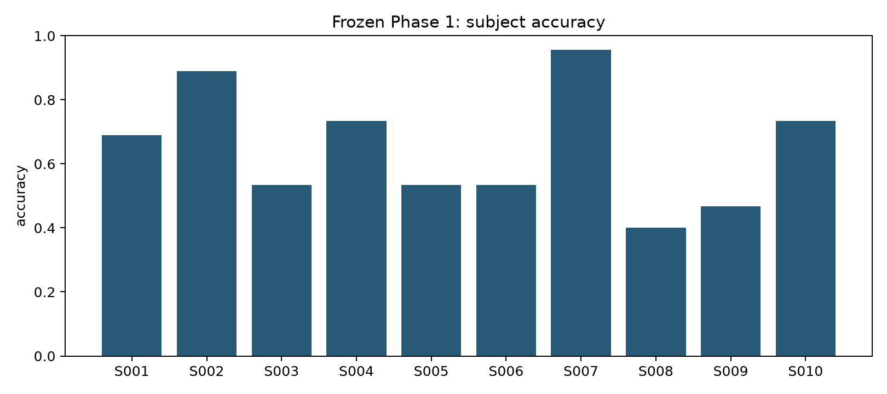
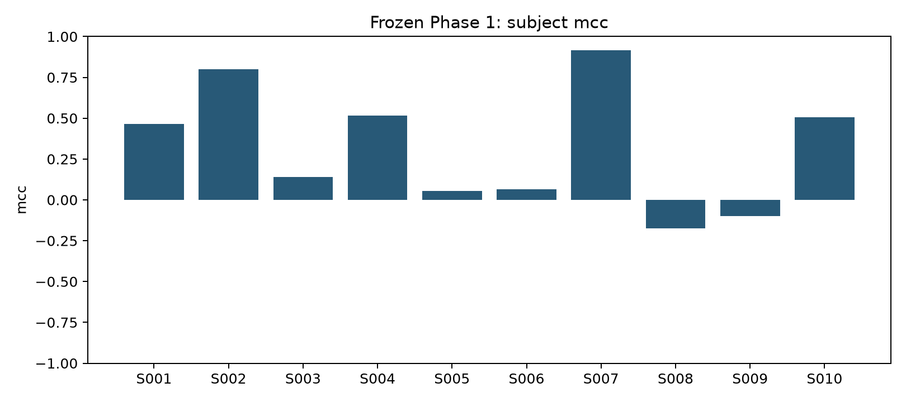
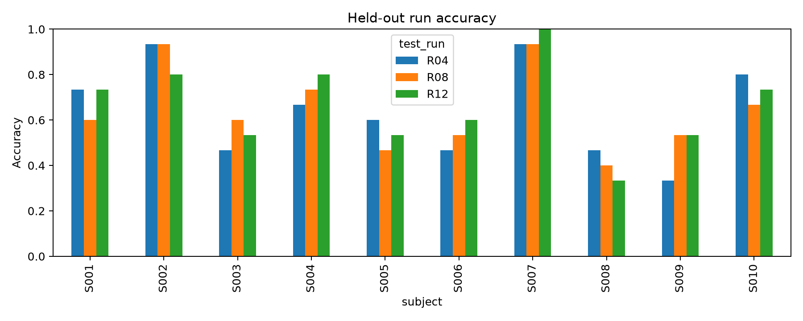
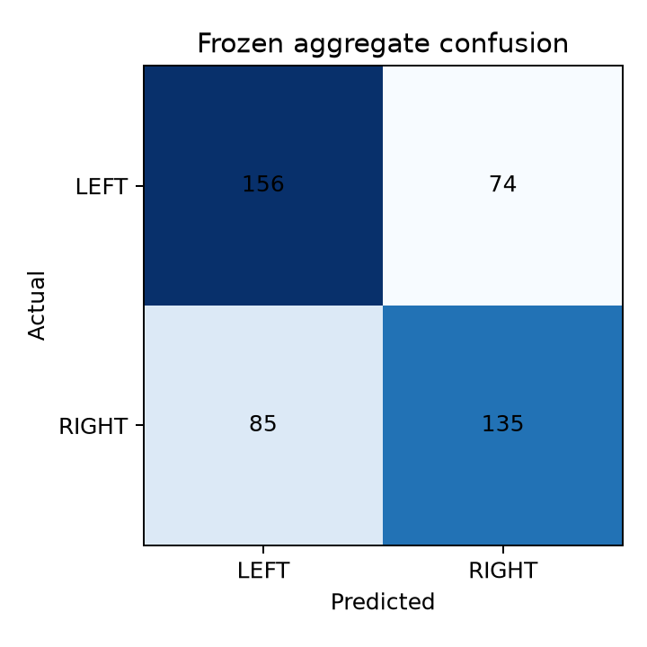
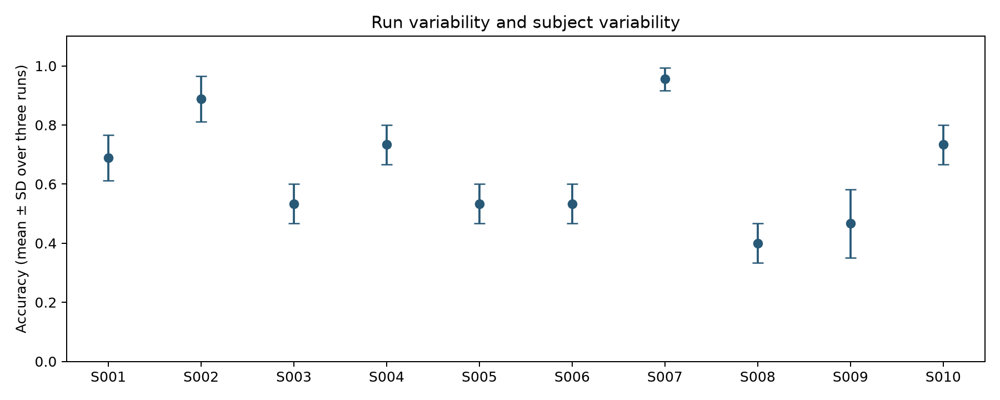

# Frozen Phase-1 descriptive analysis

All fold values and confusion counts were loaded from `results/phase1/results.json`. No fitting, tuning, or frozen-value rewriting occurred.

Best subject: S007, 95.56%; worst: S008, 40.00%.
Across ten subject mean accuracies: mean 0.646667, sample SD 0.183384.
Across thirty folds: mean 0.646667, sample SD 0.187052.

These SDs describe different units. Three folds from the same subject are not independent; SD is not a confidence interval.
F1 is binary with LEFT positive; MCC can range from −1 to 1. Subject metrics average the three stored fold scores. Summed confusion matrices are counts, not re-scored pooled metrics.

Run-to-run sample SD is in `subject_metrics.csv`; all per-run metrics and confusion cells are in `fold_analysis.csv`.

