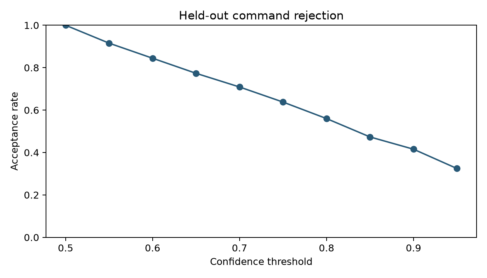
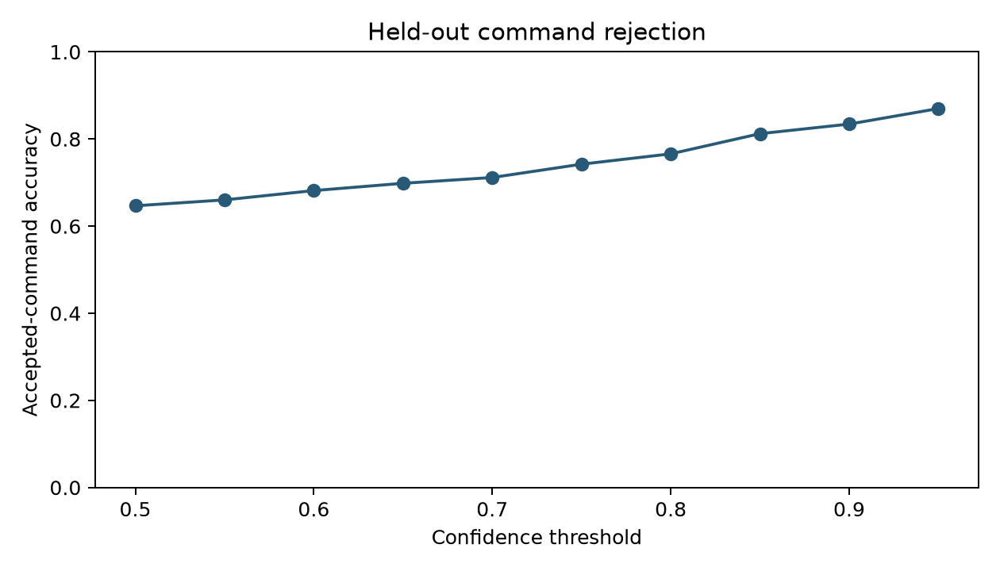
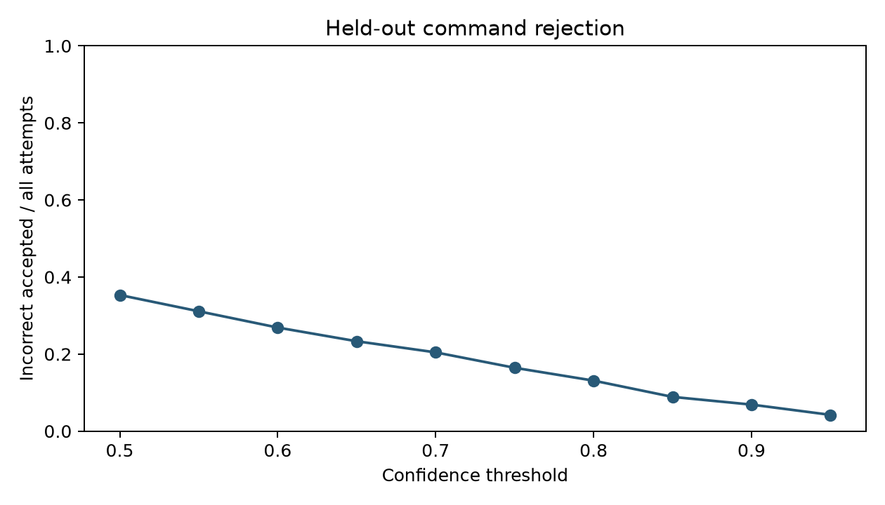

# Held-out confidence/rejection analysis

450 predictions: ten subjects, three disjoint held-out runs each. Train/test run identifiers are exported for every trial.

Correct accepted = accepted and predicted label equals the imagery annotation. Incorrect accepted = accepted and wrong. Rejected commands have no mapped word/sentence/audio.
False-command rate = incorrect accepted / all attempts. Conditional false-command rate = incorrect accepted / accepted attempts. Accepted-command accuracy = correct accepted / accepted attempts. Zero acceptance yields undefined conditional metrics, exported as null/blank.

A higher threshold reduces coverage. It can reduce false commands per attempt while conditional accuracy need not improve monotonically. These probabilities are not a validated measure of user certainty.

UNKNOWN is confidence rejection; REST was never trained. No threshold is selected as optimal without a declared cost for wrong commands versus rejection and an independent confirmation set.

| Threshold | Accepted | Rejected | Correct accepted | Incorrect accepted | Coverage | Accepted accuracy | False commands/attempt |
|---|---:|---:|---:|---:|---:|---:|---:|
| 0.50 | 450 | 0 | 291 | 159 | 100.00% | 64.67% | 35.33% |
| 0.55 | 412 | 38 | 272 | 140 | 91.56% | 66.02% | 31.11% |
| 0.60 | 380 | 70 | 259 | 121 | 84.44% | 68.16% | 26.89% |
| 0.65 | 348 | 102 | 243 | 105 | 77.33% | 69.83% | 23.33% |
| 0.70 | 319 | 131 | 227 | 92 | 70.89% | 71.16% | 20.44% |
| 0.75 | 287 | 163 | 213 | 74 | 63.78% | 74.22% | 16.44% |
| 0.80 | 252 | 198 | 193 | 59 | 56.00% | 76.59% | 13.11% |
| 0.85 | 213 | 237 | 173 | 40 | 47.33% | 81.22% | 8.89% |
| 0.90 | 187 | 263 | 156 | 31 | 41.56% | 83.42% | 6.89% |
| 0.95 | 146 | 304 | 127 | 19 | 32.44% | 86.99% | 4.22% |

