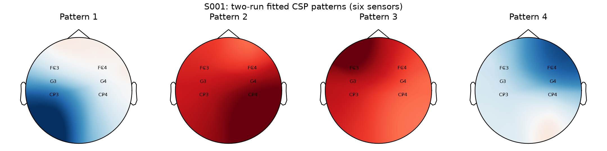
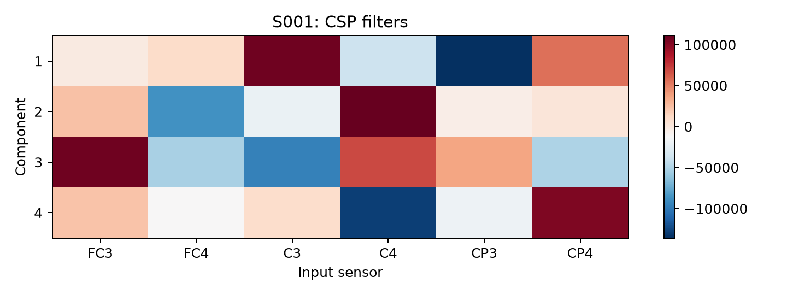
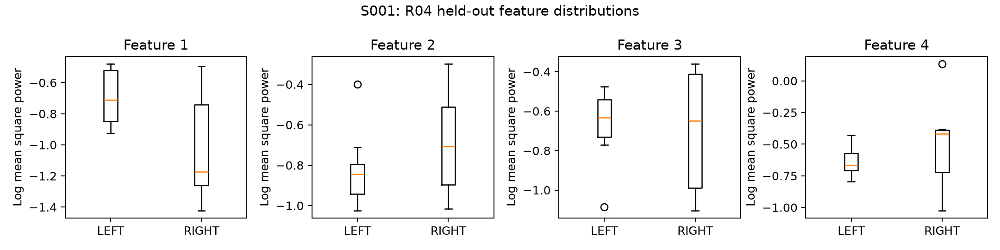
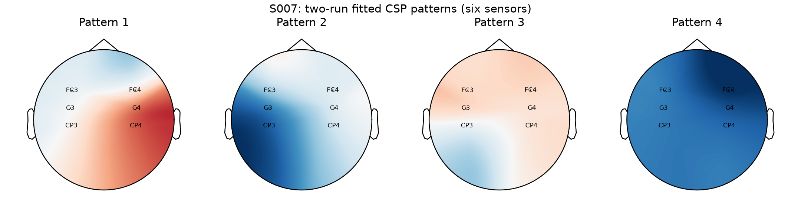
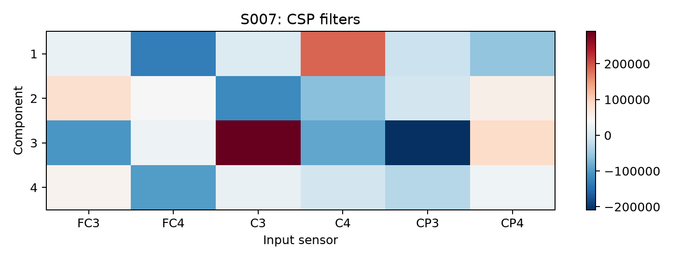
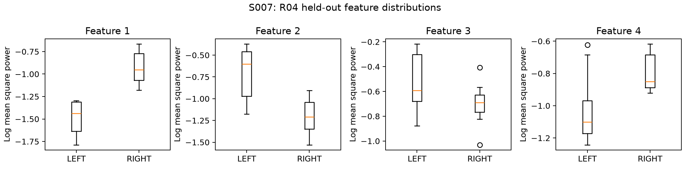
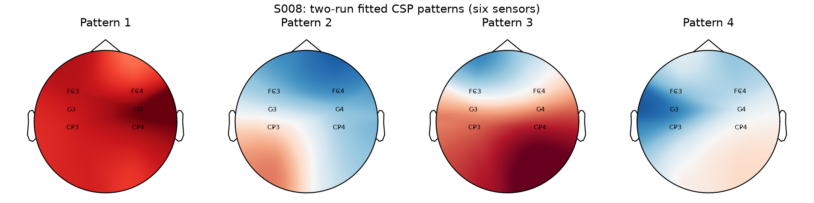
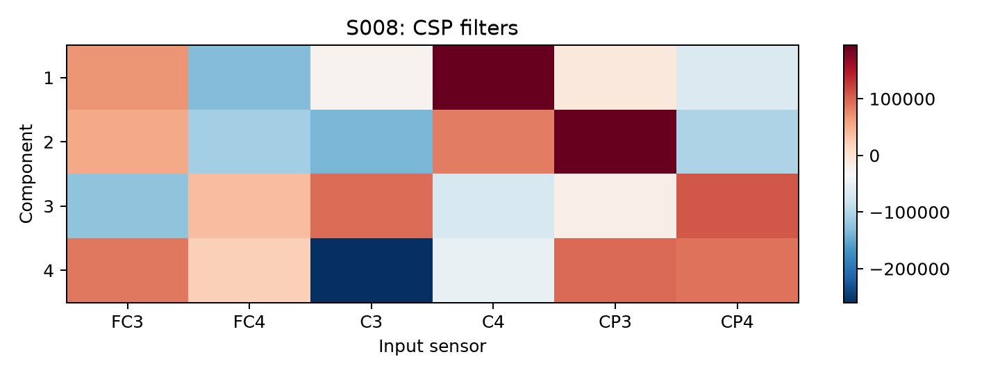
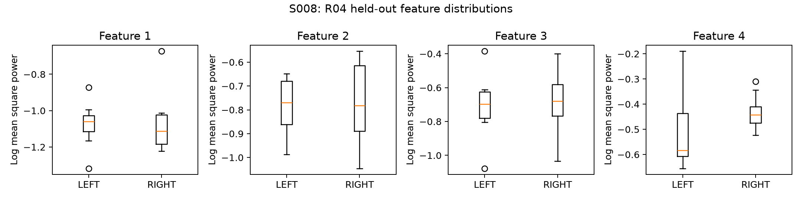

# CSP interpretation

Representatives: S001, S007, S008. S001 is the MVP subject; high/low subjects are selected using stored mean fold accuracy. All plots use R08+R12 training and R04 held-out trials.

Filters are the rows of the projection matrix: each maps six sensor signals to a component. They are extraction weights and are not anatomical activation maps.
Patterns describe the sensor-space projection of those components. Sparse six-sensor topographic interpolation is illustrative; it is neither source localization nor proof of activity in a named brain structure. Component sign is arbitrary.
Classifier features are the four log mean-square powers returned by the existing CSP transform (average-power mode, log enabled). LDA separates these feature vectors; it does not classify topographic images.
The feature plots show only the fifteen held-out R04 trials. Overlap is expected, especially for low-performing subjects. Visual separation is descriptive; no components or subjects were tuned from these plots.

Component order follows the unchanged MNE defaults. Magnitudes/signs across independently fitted subjects are not directly comparable. Sensor patterns and feature distributions can reveal separation or instability, but cannot determine whether residual artifacts drove a component.

## Observed held-out feature contrast

Mean feature 1 (LEFT / RIGHT): S001 -0.6980 / -1.0131; S007 -1.4878 / -0.9258; S008 -1.0763 / -1.0677. These observations describe this R04 fold only; the boxplots and exported trial values show the spread around each mean. Larger class-mean differences alone do not establish better classification.

Pattern colors use one symmetric range per subject across the four components. Red/blue indicate pattern polarity; signs may flip between fits and are not class labels.

## S001

## S007

## S008

